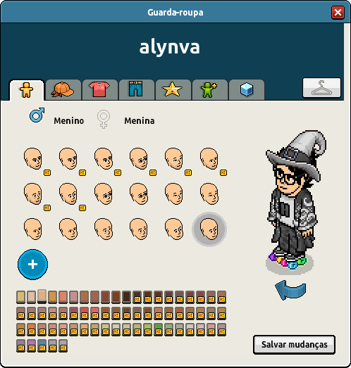
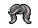

# **Habbo Avatar Figure Notation (HAFN) v2.0**

- **Status da Especificação:** Candidato
- **Data:** 2025-05-02
- **Disponível em:** [Inglês (original)](./HAFN-v2_0.md) • Português • [Espanhol](./HAFN-v2_0-es.md)

> ![NOTE]
> Este documento é uma tradução [do original](./HAFN-v2_0.md). Caso observe inconsistências em relação ao conteúdo do jogo neste idioma, por favor, [nos avise](https://github.com/Habbianos/notations/issues/new/choose) para que possamos corrigir a localização.

<details><summary>Sumário</summary>
<div class="js-toc"></div>
</details>

## **1. Introdução**

### **1.1. Resumo**

**Habbo Avatar Figure Notation (HAFN) v2** é um padrão para notação de strings em formato de texto projetado para representar **aparências de avatares do Habbo** usando códigos compactos separados por pontos. Cada string codifica dados estruturados que representam **partes da figura, IDs de conjunto e IDs de cor opcionais**, e baseia-se nos dados expostos pelo `figuredata` atualmente disponível.

Embora o HAFN v2 reflita como as figuras de avatar são codificadas nas URLs do Habbo e nos sistemas de backend, ele **não é uma notação oficial da Sulake**, e mudanças futuras podem não ser adotadas pela Sulake.

<div align="center"></div>

### **1.2. Escopo e Objetivo**

#### **1.2.1. Este Documento**

Esta especificação existe para formalizar e documentar como o Habbo codifica **strings de figura de avatar** para fins de renderização e personalização. Ela é:

- **Uma especificação mantida pela comunidade, não oficial**.
- Destinada a desenvolvedores e entusiastas construindo **ferramentas, visualizadores, renderizadores e acervos** de avatares do Habbo.
- Baseada em **arquivos `figuredata` disponíveis publicamente**.

#### **1.2.2. A Notação**

O HAFN v2 é uma representação textual da configuração do avatar que permite:

- **Armazenamento compacto em uma única linha** da aparência da figura.
- **Fácil análise, geração e validação** das strings de figura.

Ele **NÃO** inclui elementos adicionais como ações de avatar e efeitos visuais, conforme descrito na [Seção 8](#8-elementos-adicionais).

### **1.3. Público-alvo**

Este documento é voltado para desenvolvedores, arquivistas, modders e entusiastas da comunidade Habbo que trabalham com ferramentas e experiências relacionadas a avatares. Familiaridade com manipulação de strings e análise de XML (para leitura do `figuredata`) é recomendada.

---

## **2. Estado deste Documento**

O HAFN v2.0 define a estrutura atualmente conhecida das strings de avatar do Habbo, com base no comportamento de parsing observado no Habbo Hotel e personalizável através do arquivo `figuredata`.

O HAFN é **mantido pela comunidade**. Embora corresponda aos padrões de uso atuais, a Sulake pode alterar o formato a qualquer momento. Extensões futuras buscarão preservar compatibilidade retroativa sempre que possível.

---

## **3. Linguagem Normativa**

As palavras-chave "DEVE", "NÃO DEVE", "OBRIGATÓRIO", "DEVERÁ", "DEVERÁ NÃO", "RECOMENDADO", "PODE" e "OPCIONAL" neste documento devem ser interpretadas conforme descrito em [RFC 2119](https://datatracker.ietf.org/doc/html/rfc2119).

---

## **4. Conformidade**

Uma implementação é considerada compatível com o HAFN v2.0 se aderir à sintaxe, lógica de validação e regras de resolução definidas neste documento. Um implementador de parser em conformidade:

- **DEVE** resolver tipos de partes, IDs de conjunto e IDs de cor usando uma estrutura `figuredata` válida.
- **DEVE** rejeitar quaisquer strings ou identificadores não presentes no `figuredata` atual.
- **PODE** estender a funcionalidade através de extensões não oficiais, desde que **NÃO INTERFIRAM** na conformidade central.

Uma string HAFN v2.0 válida **DEVE**:

1. Seguir a definição de sintaxe na [Seção 5](#5-definição-de-sintaxe).
2. Referenciar apenas tipos de parte, IDs de conjunto e IDs de cor conhecidos definidos em `figuredata`.
3. Ser totalmente validada antes do processamento para evitar configurações de avatar indefinidas ou malformadas.

---

## **5. Definição de Sintaxe**

### **5.1. Visão Geral**

Uma string HAFN v2 codifica a **aparência completa de um avatar do Habbo**. Consiste em múltiplas **partes da figura**, separadas por pontos (`.`). Cada parte codifica um **tipo**, **ID de conjunto** e até **dois IDs de cor**.

### **5.2. Gramática**

A Forma de Backus-Naur Estendida (EBNF) a seguir define a sintaxe do HAFN v2.0:

```ebnf
<figure>    ::= <part> ("." <part>)*
<part>      ::= <type> "-" <setId> [ "-" <colorId1> [ "-" <colorId2> ] ]
<type>      ::= "hr" | "hd" | "ch" | "lg" | "sh" | "ea" | "cc" | ... ; (ver figuredata)
<setId>     ::= <positiveInteger>
<colorId1>  ::= <positiveInteger>
<colorId2>  ::= <positiveInteger>
```

### **5.3. Restrições Lexicais**

| Campo         | Tipo      | Descrição                                                               |
|---------------|-----------|-------------------------------------------------------------------------|
| `type`        | String    | Um **tipo de parte** válido, conforme definido em `figuredata`          |
| `setId`       | Inteiro   | Um **ID de conjunto** válido pertencente ao tipo de parte especificado  |
| `colorId1`    | Inteiro   | Um **ID de cor primária** (**PODE** ser obrigatório dependendo da parte) |
| `colorId2`    | Inteiro   | Um **ID de cor secundária**, **OPCIONAL** (para partes com duas camadas) |

Cada parte **DEVE** corresponder a uma entrada `set` existente no arquivo `figuredata` sob o `<settype type="...">` correspondente.

### **5.4. Expressão Regular (Simplificada)**

A expressão regular a seguir pode ser usada para validar a estrutura geral de uma string HAFN v2.0:

```regex
(?:[a-z]{2}-\d+(?:-\d+(?:-\d+)?)?)(?:\.(?:[a-z]{2}-\d+(?:-\d+(?:-\d+)?)?))*
```

---

## **6. Modelo de Processamento**

### **6.1. Partes Separadas por Ponto**

Cada parte é separada por um **ponto (`.`)**. O parser **DEVE**:

- Dividir na `.` para extrair partes individuais
- Dividir cada parte por `-` para determinar seu tipo, ID de conjunto e cores opcionais
- Validar o tipo de parte e o ID de conjunto usando uma estrutura `figuredata` atual

### **6.2. Regras de Validação**

- **Tipos de parte** **DEVEM** existir no `figuredata` sob `<settype type="...">`
- **IDs de conjunto** **DEVEM** ser válidos para o tipo especificado
- **IDs de cor** **DEVEM** estar presentes na paleta (`paletteid`) referenciada pela definição do conjunto

### **6.3. Componentes Opcionais**

- Algumas partes **PODEM** omitir IDs de cor completamente.
- Outras **EXIGEM** um ou dois IDs de cor, dependendo da definição do conjunto.
- As partes **PODEM** aparecer em qualquer ordem, embora alguns sistemas possam impor ou esperar uma ordem típica.

### **6.4. Tratamento de Erros**

| Código de Erro           | Descrição                                                     |
|--------------------------|---------------------------------------------------------------|
| **ERR_UNKNOWN_TYPE**     | `type` não encontrado no `figuredata` atual                   |
| **ERR_INVALID_SETID**    | ID de conjunto não definido para o tipo especificado          |
| **ERR_INVALID_COLOR**    | ID de cor não válido para a paleta usada no conjunto          |
| **ERR_FORMAT_SYNTAX**    | Delimitador `-` ausente, uso incorreto de delimitadores       |
| **ERR_PART_INCOMPLETE**  | Falta ID de conjunto ou ID de cor obrigatório                 |

Um parser compatível com HAFN **DEVE** rejeitar strings inválidas e relatar o erro apropriado.

---

## **7. Exemplos**

### **7.1. Exemplo Básico**

Considere a seguinte string HAFN v2.0:

```txt
hr-890-45.hd-600-10.ch-665-1408.lg-716-1408-1408
```


**Explicação:**

- `hr-890-45` → Cabelo, ID de conjunto 890, cor 45
- `hd-600-10` → Cabeça, ID de conjunto 600, cor 10
- `ch-665-1408` → Camisa (peito), conjunto 665, cor 1408
- `lg-716-1408-1408` → Calças (pernas), conjunto 716, cores duplas 1408

### **7.2. Exemplo Completo**

O avatar pode ter muito mais partes definidas:

```txt
hr-802-37.hd-180-1.ch-3030-1408.lg-3023-64.sh-3068-1408-64.ea-1403-1408.cc-3280-64-1408.cp-3284-64
```


**Explicação:**

- `hr-802-37` → Cabelo, conjunto 802, cor 37
- `hd-180-1` → Cabeça, conjunto 180, cor 1
- `ch-3030-1408` → Camisa, conjunto 3030, cor 1408
- `lg-3023-64` → Calças, conjunto 3023, cor 64
- `sh-3068-1408-64` → Sapatos, conjunto 3068, cor primária 1408, secundária 64
- `ea-1403-1408` → Óculos, conjunto 1403, cor 1408
- `cc-3280-64-1408` → Casaco, conjunto 3280, cor primária 64, secundária 1408
- `cp-3284-64` → Estampa, conjunto 3284, cor 64

### **7.3. Outros Exemplos**

    

---

## **8. Elementos Adicionais**

Existem outros aspectos relacionados à figura do avatar que **não** são cobertos por esta especificação, como itens de vestuário que usam múltiplas partes, ações do avatar (por exemplo, deitar, sentar, acenar, dançar) e efeitos visuais. Esses elementos não estão presentes na notação em si e devem ser considerados **puramente informativos** neste documento; eles **não** definem ou alteram a notação.

Abaixo estão links para fontes de dados relevantes usadas para computar ou renderizar esses elementos. Documentação adicional pode ser escrita para explicá-los em mais detalhes:

- [`figuremap.xml`](https://images.habbo.com/gordon/flash-assets-PRODUCTION-202502041750-974842909/figuremap.xml)
- [`HabboAvatarActions.xml`](https://images.habbo.com/gordon/flash-assets-PRODUCTION-202502041750-974842909/HabboAvatarActions.xml)
- [`effectmap.xml`](https://images.habbo.com/gordon/flash-assets-PRODUCTION-202502041750-974842909/effectmap.xml)

---

## **9. Extensibilidade e Trabalhos Futuros**

Versões futuras **PODEM** incluir:

1. Suporte para **tipos de parte desconhecidos** com renderização de fallback
2. **Conjuntos nomeados** ou auxiliares de mapeamento para representações mais amigáveis ao usuário
3. Uma versão **comprimida ou tokenizada** da string de figura para uso em URLs

Revisões da especificação **DEVERÃO** ser versionadas adequadamente, e a compatibilidade retroativa **PODE** ser mantida quando possível.

---

## **10. Considerações de Segurança**

Embora o HAFN v2 seja uma notação textual e **não execute código**, as implementações **DEVEM** sanitizar e validar rigorosamente as strings de entrada para prevenir problemas como:

- Buffer overflows
- Ataques de injeção
- Renderização incorreta devido a entrada malformada

> [!IMPORTANTE]
> Strings HAFN v2 **não verificam propriedade de roupas ou cores**. Elas representam **apenas aparência** e não devem ser usadas para impor acesso ou propriedade de partes da figura.

A adesão estrita à sintaxe e às diretrizes de processamento é necessária para uma implementação segura.

---

## **11. Tabela de Referência para Categorias de Partes da Figura**

A tabela a seguir lista os **identificadores de duas letras atualmente suportados** usados para partes da figura do avatar, juntamente com seus nomes, ícones e exemplos.

| Nome da Categoria | Ícone da Categoria                               | Identificador da Subcategoria ▲ | Nome da Subcategoria               | Ícone da Subcategoria                                                                                                                                                                                           | Exemplos                                                                                                                                                                    |
|-------------------|--------------------------------------------------|---------------------------------|------------------------------------|-----------------------------------------------------------------------------------------------------------------------------------------------------------------------------------------------------------------|-----------------------------------------------------------------------------------------------------------------------------------------------------------------------------|
| Parte de cima     |  | `ca`                            | Bijuterias (acessórios superiores) |                                                                            |                   |
| Parte de cima     |  | `cc`                            | Casacos                            |                                                                                                                  |   |
| Parte de cima     |  | `ch`                            | Camisas                            |                                                                                                                      |            |
| Parte de cima     |  | `cp`                            | Estampas                           |                                                                                                                |            |
| Cabeça            |          | `ea`                            | Óculos (acessórios de rosto)       |                                                                                                                |                  |
| Cabeça            |          | `fa`                            | Máscaras (acessórios faciais)      |                                                                      |           |
| Cabeça            |          | `ha`                            | Chapéus                            |                                                                                                                    |      |
| Corpo             |     | `hd`                            | Rosto e Corpo                      |     |      |
| Cabeça            |          | `he`                            | Acessórios                         |                                                                                  |               |
| Cabeça            |          | `hr`                            | Cabelos                            |                                                                                                                      |                 |
| Parte de baixo    |  | `lg`                            | Calças                             |                                                                                                          |           |
| Parte de baixo    |  | `sh`                            | Sapatos                            |                                                                                                              |     |
| Parte de baixo    |  | `wa`                            | Cintos (acessórios inferiores)     |                                                                      |                 |

---

## **12. Referências**

- *[XML `figuredata` do Habbo](https://www.habbo.com.br/gamedata/figuredata/1)*
- *[Definição `external_flash_texts` do Habbo](https://www.habbo.com.br/gamedata/external_flash_texts/1)*
- *[Serviço de Renderização de Avatar do Habbo](https://www.habbo.com.br/habbo-imaging/avatarimage?user=alynva&direction=2&head_direction=3&gesture=sml&action=wlk,crr=1&size=b)*
- *[Habbo Imager pelo site de fãs "Pixels Emotions"](https://pixelsemotion.tumblr.com/habbo-imager)*
- *[Editor de Figuras pelo site de fãs "Habbo News"](https://www.habbonews.net/p/habbo-visuais.html)*

---

### **Registro de Mudanças**

- **v2.0.0 – 2025-04-07**
  - Rascunho inicial da especificação Habbo Avatar Figure Notation (HAFN).
- **v2.0.1 – 2025-04-08**
  - Rascunho inicial da seção de elementos adicionais.
- **v2.0.2 – 2025-04-12**
  - Ajustes menores no rascunho.
- **v2.0.3 – 2025-04-13**
  - Migrado do `v1` para o `v2` para deixar o `v1` como notação baseada em numéricos.
- **v2.0.4 – 2025-04-14**
  - Adicionada a imagem do guarda-roupa.
  - Completada a seção de exemplos.
  - Ajustes menores no rascunho.
- **v2.0.5 – 2025-04-17**
  - Padronizada a estrutura da especificação.
  - Concluída a seção de conformidade.
  - Adicionada a seção de "Expressão Regular".
  - Movida a seção de Tratamento de Erros para dentro do Modelo de Processamento.
  - Ajustes menores no rascunho.
- **v2.0.6 - 2025-04-27**
  - Seção de tabela de referência adicionada
- **v2.0.7 - 2025-05-02**
  - Observação nas versões traduzidas adicionada
