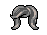
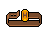

# **Habbo Avatar Figure Notation (HAFN) v2.0**

- **Estado de la Especificación:** Borrador
- **Fecha:** 2025-05-02
- **Disponible en:** [Inglés (original)](./HAFN-v2_0.md) • [Portugués](./HAFN-v2_0-br.md) • Español

> [!NOTE]
> Este documento es una traducción [del original](./HAFN-v2_0.md). Si observas inconsistencias con el contenido del juego en este idioma, por favor, [avísanos](https://github.com/Habbianos/notations/issues/new/choose) para que podamos corregir la localización.

<details><summary>Índice</summary>
<div class="js-toc"></div>
</details>

## **1. Introducción**

### **1.1. Resumen**

**Habbo Avatar Figure Notation (HAFN) v2** es un estándar para la notación de strings de texto diseñado para representar **apariencias de avatares de Habbo** usando códigos compactos separados por puntos. Cada string codifica datos estructurados que representan **partes de la figura, set IDs y color IDs**, y se basa en los datos expuestos por la `figuredata` disponible.

Aunque HAFN v2 refleja cómo se codifican las figuras de avatar en las URLs de Habbo y en los sistemas backend, **no es una notación oficial de Sulake**, y futuros cambios podrían no ser adoptados por Sulake.

<div align="center"></div>

### **1.2. Alcance y Objetivo**

#### **1.2.1. Este Documento**

Esta especificación existe para formalizar y documentar cómo Habbo codifica **strings de figura de avatar** para renderización y personalización. Está dirigida a:

- **Una especificación no oficial, mantenida por la comunidad.**
- Desempeñada para desarrolladores y entusiastas que construyen **herramientas, visualizadores, renderizadores y repositorios** de avatares de Habbo.
- Basado en **archivos `figuredata` disponibles públicamente**.

#### **1.2.2. La Notación**

HAFN v2 es una representación textual de la configuración del avatar que permite:

- **Almacenamiento compacto de una sola línea** de la apariencia del avatar.
- **Fácil análisis, generación y validación** de las strings de figura.

NO incluye elementos adicionales como acciones del avatar y efectos visuales, tal como se describe en la [Sección 8](#8-elementos-adicionales).

### **1.3. Audiencia**

Este documento está dirigido a desarrolladores, archivistas, modders y entusiastas de la comunidad Habbo que trabajan en herramientas y experiencias relacionadas con avatares. Se recomienda familiaridad con manipulación de strings y análisis de XML (para leer `figuredata`).

---

## **2. Estado de este Documento**

HAFN v2.0 define la estructura actualmente conocida de strings de los avatares de Habbo, basada en el comportamiento de análisis observado en Habbo Hotel y es personalizable mediante el archivo `figuredata`.

HAFN es **mantenido por la comunidad**. Aunque coincide con los patrones de uso actuales, Sulake puede cambiar el formato en cualquier momento. Futuras extensiones intentarán preservar la retrocompatibilidad siempre que sea posible.

---

## **3. Lenguaje Normativo**

Las palabras clave "DEBE", "NO DEBE", "OBLIGATORIO", "DEBERÁ", "NO DEBERÁ", "RECOMENDADO", "PUEDE" y "OPCIONAL" en este documento deben interpretarse según lo descrito en [RFC 2119](https://datatracker.ietf.org/doc/html/rfc2119).

---

## **4. Conformidad**

Una implementación se considera conforme con HAFN v2.0 si sigue la syntax, la lógica de validación y las reglas de resolución definidas en este documento. Una implementación de analizador (parser) conforme:

- **DEBE** resolver tipos de parte, sets de IDs y color IDs utilizando una estructura `figuredata` válida.
- **DEBE** rechazar cualquier string o identificadores no presentes en el `figuredata` actual.
- **PODRÍA** extender la funcionalidad con extensiones no oficiales, siempre que **NO INTERFIERAN** con la conformidad central.

Una string válida de HAFN v2.0 **DEBE**:

1. Seguir la definición de syntax en la [Sección 5](#5-definición-de-syntax).
2. Referenciar únicamente tipos de partes, Set IDs y color IDs conocidos, definidos en `figuredata`.
3. Validar completamente antes de procesar para evitar configuraciones de avatar indefinidas o malformadas.

---

## **5. Definición de Syntax**

### **5.1. Visión General**

Una string HAFN v2 codifica la **apariencia completa de un avatar de Habbo**. Consiste en múltiples **partes de figura**, separadas por puntos (`.`). Cada parte codifica un **tipo**, un **set ID** y hasta **dos color IDs**.

### **5.2. Gramática**

La Forma de Backus-Naur Extendida (EBNF) que sigue define el syntax de HAFN v2.0:

```ebnf
<figure>    ::= <part> ("." <part>)*
<part>      ::= <type> "-" <setId> [ "-" <colorId1> [ "-" <colorId2> ] ]
<type>      ::= "hr" | "hd" | "ch" | "lg" | "sh" | "ea" | "cc" | ... ; (ver figuredata)
<setId>     ::= <positiveInteger>
<colorId1>  ::= <positiveInteger>
<colorId2>  ::= <positiveInteger>
```

### **5.3. Restricciones Léxicas**

| Campo         | Tipo      | Descripción                                                                             |
|---------------|-----------|-----------------------------------------------------------------------------------------|
| `type`        | Cadena    | Un **tipo** de parte válido según `figuredata`                                          |
| `setId`       | Entero    | Un **set ID** válido perteneciente al tipo de parte especificado                        |
| `colorId1`    | Entero    | Un **color ID válido primario** (**PODRÍA** ser obligatorio según la parte)             |
| `colorId2`    | Entero    | Un **color ID válido secundario**, es **OPCIONAL** (para partes con dos capas de color) |

Cada parte **DEBE** corresponder a una entrada `set` existente en `figuredata` bajo `<settype type="...">`.

### **5.4. Expresión Regular (Simplificada)**

La siguiente expresión regular puede usarse para validar la estructura general de una string HAFN v2.0:

```regex
(?:[a-z]{2}-\d+(?:-\d+(?:-\d+)?)?)(?:\.(?:[a-z]{2}-\d+(?:-\d+(?:-\d+)?)?))*
```

---

## **6. Modelo de Procesamiento**

### **6.1. Partes Separadas por Punto**

Cada parte se separa con un **punto (`.`)**. El parser **DEBE**:

- Dividir en `.` para extraer partes individuales
- Dividir cada parte por `-` para identificar tipo, set ID y colores opcionales
- Validar el tipo de parte y el set ID usando una estructura `figuredata` actualizada

### **6.2. Reglas de Validación**

- Los **tipos de parte** **DEBEN** existir en `figuredata` bajo `<settype type="...">`
- Los **set ID** **DEBEN** ser válidos para el tipo especificado
- Los **color IDs** **DEBEN** estar presentes en la paleta (`paletteid`) referenciada por la definición de ese set

### **6.3. Componentes Opcionales**

- Algunas partes **PODRÍAN** omitir completamente los color IDs.
- Otras **REQUIEREN** uno o dos color IDs, según la definición del set.
- Las partes **PODRÍAN** aparecer en cualquier orden, aunque algunos sistemas pueden imponer o esperar un orden típico.

### **6.4. Manejo de Errores**

| Código de Error           | Descripción                                                            |
|---------------------------|------------------------------------------------------------------------|
| **ERR_UNKNOWN_TYPE**      | `type` no encontrado en el `figuredata` actual                         |
| **ERR_INVALID_SETID**     | Set ID no definido para el tipo especificado                           |
| **ERR_INVALID_COLOR**     | Color ID no válido para la paleta usada en el set                      |
| **ERR_FORMAT_SYNTAX**     | Falta `-`, uso incorrecto de delimitadores, formato de partes inválido |
| **ERR_PART_INCOMPLETE**   | Falta set ID o color ID obligatorio                                    |

Un parser conforme con HAFN **DEBE** rechazar strings inválidas y reportar el error apropiado.

---

## **7. Ejemplos**

### **7.1. Ejemplo Básico**

Considere el siguiente ejemplo de string HAFN v2.0:

```txt
hr-890-45.hd-600-10.ch-665-1408.lg-716-1408-1408
```


**Explicación:**

- `hr-890-45` → Cabello, set ID `890`, color `45`
- `hd-600-10` → Cabeza, set ID `600`, color `10`
- `ch-665-1408` → Camisa (pecho), set ID `665`, color `1408`
- `lg-716-1408-1408` → Pantalones (piernas), set ID `716`, color primario y secundario `1408`

### **7.2. Ejemplo Completo**

El avatar puede tener muchas más partes definidas:

```txt
hr-802-37.hd-180-1.ch-3030-1408.lg-3023-64.sh-3068-1408-64.ea-1403-1408.cc-3280-64-1408.cp-3284-64
```


**Explicación:**

- `hr-802-37` → Cabello, set ID `802`, color `37`
- `hd-180-1` → Cabeza, set ID `180`, color `1`
- `ch-3030-1408` → Camisa, set ID `3030`, color `1408`
- `lg-3023-64` → Pantalones, set ID `3023`, color `64`
- `sh-3068-1408-64` → Zapatos, set ID `3068`, color primario `1408`, secundario `64`
- `ea-1403-1408` → Gafas, set ID `1403`, color `1408`
- `cc-3280-64-1408` → Abrigo, set ID `3280`, color primario `64`, secundario `1408`
- `cp-3284-64` → Estampado, set ID `3284`, color `64`

### **7.3. Otros Ejemplos**

    

---

## **8. Elementos Adicionales**

Existen otros aspectos relacionados con la figura del avatar que **no** estan cubiertos por esta especificación, como prendas que usan múltiples partes, acciones del avatar (por ejemplo, acostarse, sentarse, saludar, bailar) y efectos visuales. Estos elementos no estan presentes en la notación en sí y deben considerarse **puramente informativos** en este documento; estos **no** definen ni alteran la notación en ningún sentido.

A continuación tienen enlaces a fuentes de datos relevantes usadas para calcular o renderizar esos elementos. En un futuro se puede redactar documentación adicional para explicarlos con más detalle:

- [`figuremap.xml`](https://images.habbo.com/gordon/flash-assets-PRODUCTION-202502041750-974842909/figuremap.xml)
- [`HabboAvatarActions.xml`](https://images.habbo.com/gordon/flash-assets-PRODUCTION-202502041750-974842909/HabboAvatarActions.xml)
- [`effectmap.xml`](https://images.habbo.com/gordon/flash-assets-PRODUCTION-202502041750-974842909/effectmap.xml)

---

## **9. Extensibilidad y Trabajos Futuros**

Futuras versiones **PODRÍAN** incluir:

1. Soporte para **tipos de parte desconocidos** con renderizado de reserva
2. **Sets nombrados** o mapeadores para representaciones más amigables
3. Una versión **comprimida o tokenizada** de la string de figura para su uso en URLs

Las revisiones de la especificación **DEBERÁN** versionarse adecuadamente, y la retrocompatibilidan **DEBERÍA** mantenerse mientras sea posible.

---

## **10. Consideraciones de Seguridad**

Aunque HAFN v2 es una notación textual y **no ejecuta código**, las implementaciones **DEBEN** sanitizar y validar rigurosamente las input strings para prevenir:

- Desbordamientos de búfer
- Ataques de inyección
- Renderización incorrecta debido a inputs malformadas

> [!IMPORTANT]
> Las strings HAFN v2 **no verifican la propiedad** de ropa o colores. **Solo representan la apariencia** y no deben usarse para imponer acceso o la propiedad de partes de la figura.

La estricta adherencia al syntax y a las directrices de procesamiento son requeridas para una implementación segura.

---

## **11. Referencias**

- [1] *XML `figuredata` de Habbo*, Habbo.es. Disponible en: [https://www.habbo.es/gamedata/figuredata/1](https://www.habbo.es/gamedata/figuredata/1)
- [2] *Definición `external_flash_texts` de Habbo*, Habbo.es. Disponible en: [https://www.habbo.es/gamedata/external_flash_texts/1](https://www.habbo.es/gamedata/external_flash_texts/1)
- [3] *Servicio de Renderizado de Avatar de Habbo*, Habbo.com.br. Disponible en: [https://www.habbo.com.br/habbo-imaging/avatarimage?user=alynva&direction=2&head_direction=3&gesture=sml&action=wlk,crr=1&size=b](https://www.habbo.com.br/habbo-imaging/avatarimage?user=alynva&direction=2&head_direction=3&gesture=sml&action=wlk,crr=1&size=b)
- [4] *Habbo Imager*, Pixels Emotions (sitio de fans). Disponible en: [https://pixelsemotion.tumblr.com/habbo-imager](https://pixelsemotion.tumblr.com/habbo-imager)
- [5] *Editor de Figuras*, Habbo News (sitio de fans). Disponible en: [https://www.habbonews.net/p/habbo-visuais.html](https://www.habbonews.net/p/habbo-visuais.html)

---

## **12. Colaboradores**

Este documento fue desarrollado con contribuciones de:

- **[Alisson Nunes, "alynva"](https://alynva.com)**: Autor principal
- **[Matheus, "ferrazmatheus"](https://x.com/ImFerraz_)**: Investigación
- **["uzuki"](https://x.com/uzukies)**: Escritura (Revisión y Edición)

## **13. Registro de Cambios**

- **v2.0.0 – 2025-04-07**
  - Borrador inicial de la especificación Habbo Avatar Figure Notation (HAFN).
- **v2.0.1 – 2025-04-08**
  - Borrador inicial de la sección de elementos adicionales.
- **v2.0.2 – 2025-04-12**
  - Ajustes menores en el borrador.
- **v2.0.3 – 2025-04-13**
  - Migración de `v1` a `v2` para permitir que `v1` sea la notación basada en números.
- **v2.0.4 – 2025-04-14**
  - Se añadió la imagen del armario.
  - Se completó la sección de ejemplos.
  - Ajustes menores en el borrador.
- **v2.0.5 – 2025-04-17**
  - Estandarización de la estructura de especificaciones.
  - Se completó la sección de conformidad.
  - Adición de la sección "Expresión Regular".
  - Movimiento de la sección de 'Manejo de Errores' dentro del 'Modelo de Procesamiento'.
  - Ajustes menores en el borrador.
- **v2.0.6 - 2025-04-27**
  - Sección de tabla de referencia agregada.
- **v2.0.7 - 2025-05-02**
  - Se añadió una observación en las versiones traducidas.
  - Sección de colaboradores añadidos.
  - Reorganizando las últimas secciones y renombrando la Tabla de Referencias a Apéndices.

---

## **14. Apéndices**

### **14.1. Apéndice A. Categorías de Partes de la Figura**

La siguiente tabla enumera los **identificadores de dos letras actualmente soportados** utilizados para las partes de la figura del avatar, junto con sus nombres, íconos y ejemplos.

| Nombre de Categoría | Ícono de Categoría                            | Identificador de Subcategoría ▲ | Nombre de Subcategoría             | Ícono de Subcategoría                                                                                                                                                                               | Ejemplos                                                                                                                                                                      |
|---------------------|-----------------------------------------------|---------------------------------|------------------------------------|-----------------------------------------------------------------------------------------------------------------------------------------------------------------------------------------------------|-------------------------------------------------------------------------------------------------------------------------------------------------------------------------------|
| Torso               |       | `ca`                            | Joyería (accesorios superiores)    |                                                                |                 |
| Torso               |       | `cc`                            | Abrigos                            |                                                                                                      |   |
| Torso               |       | `ch`                            | Camisas                            |                                                                                                        |              |
| Torso               |       | `cp`                            | Serigrafías                        |                                                                                              |          |
| Cabeza              |       | `ea`                            | Lentes (accesorios faciales)       |                                                                                                    |                      |
| Cabeza              |       | `fa`                            | Máscaras (accesorios de cara)      |                                                          |             |
| Cabeza              |       | `ha`                            | Sombreros                          |                                                                                                    |    |
| Cuerpo              |  | `hd`                            | Cara & Cuerpo                      |     |    |
| Cabeza              |       | `he`                            | Accesorios                         |                                                                      |                 |
| Cabeza              |       | `hr`                            | Cabellos                           |                                                                                                        |                   |
| Piernas             |      | `lg`                            | Pantalones                         |                                                                                      |     |
| Piernas             |      | `sh`                            | Zapatos                            |                                                                                                  |       |
| Piernas             |      | `wa`                            | Cinturones (accesorios inferiores) |                                                          |           |
