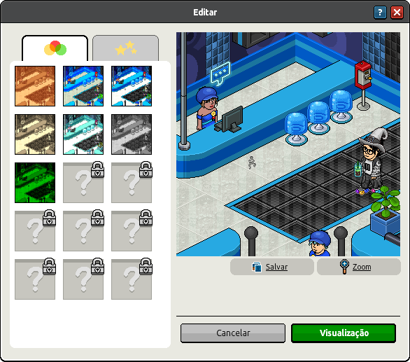

# **Habbo Camera Data Structure (HCDS) v1.0**

- **Specification Status:** Draft
- **Date:** 2025-04-29
- **Available in:** English

<details><summary>Table of Contents</summary>
<div class="js-toc"></div>
</details>

## **1. Introduction**

### **1.1 Abstract**

**Habbo Camera Data Structure (HCDS) v1** is a standard for the JSON schema designed to represent a snapshot of a room scene for the camera system of Habbo Hotel. It encodes metadata, graphical components such as planes and sprites, filter effects, and rendering state information.

While HCDS v1 reflects how Habbo Hotel interprets a room schene, it is **not an official Sulake data structure**, and future changes may not be adopted by Sulake.

<div align=center></div>

### **1.2 Scope and Intent**

#### **1.2.1. This Document**

This specification exists to formalize and document how Habbo serializes a **room scene** to be rendered by the server into a final image. It is:

- **An unofficial community-maintained specification**.
- Intended for developers and hobbyists building tools to **parse, generate, and manipulate** room scenes before they're rendered outside the game.

#### **1.2.2. The Data Structure**

HCDS v1 is a JSON representation of a room scene that enables:

- **Interoperability** between the client and the server for rendering purposes.
- **Sucurity** that the rendered image does not include sprites not allowed.

### **1.3 Audience**

This document is intended for developers, system architects, toolmakers, and content creators who work with Habbo room rendering engines or need to persist, transfer, or inspect the camera data.

---

## **2. Status of This Document**

HCDS v1.0 defines the a known structure for how the Camera feature serializes the relevant part of the screen to be rendered into a picture by the server, based on the original implementation in Habbo Hotel.

HCDS is **community-maintained**. While efforts are made to ensure accuracy, Sulake may change the format at any time. Future extensions will aim to preserve backward compatibility whenever possible.

---

## **3. Normative Language**

The key words "MUST", "MUST NOT", "REQUIRED", "SHALL", "SHALL NOT", "SHOULD", "SHOULD NOT", "RECOMMENDED", "MAY", and "OPTIONAL" in this document are to be interpreted as described in [RFC 2119](https://datatracker.ietf.org/doc/html/rfc2119).

---

## **4. Conformance**

An implementation is considered HCDS v1.0 compliant if it adheres to the structural rules, value constraints, and processing semantics defined in this document. A conforming parser or generator implementation:

- **MUST** validate every property and subschema exactly as defined in the JSON Schema ([Appendix A](#11-appendix-a-json-schema)), including types, required fields, and value ranges.
- **MUST** verify the top‐level `checksum` matches the computed integrity check over the serialized payload before accepting the snapshot.

A valid HCDS v1.0 room snapshot **MUST**:

1. Include all **required** top-level properties: `planes`, `sprites`, `modifiers`, `filters`, `roomid`, `status`, `timestamp`, and `checksum`.
2. Ensure each `plane.cornerPoints` array contains **exactly four** valid `point` objects with integer `x` and `y`.
3. Constrain each `filter.alpha` to an **integer** in the range **0–255**.

Implementations **MAY** support extra, non-interfering features, such as custom filter types or metadata fields, provided those extensions do not break core compliance with the schema in [Appendix A](#11-appendix-a-json-schema).

---

## 5. Definition

### 5.1 Terminology

| Term     | Definition                                                                          |
| -------- | ----------------------------------------------------------------------------------- |
| Snapshot | A serialized capture of all information needed to render a room at a point in time. |
| Plane    | A flat polygon (always a rectangle here) defining a portion of room geometry.       |
| Sprite   | A 2D image placed in the scene, rendered after planes.                              |
| Modifier | ?Unknown?                                                                           |
| Filter   | A post-processing effect applied to the final rendered image.                       |
| Z-depth  | The drawing order depth; higher numbers render "closer" to the camera.              |

### 5.2 Overall Structure

A room snapshot object consists of four major component groups plus metadata:

1. **Geometry** (planes)
2. **Sprites** (scene actors)
3. **Visual Effects** (filters)
4. **Metadata & State** (room id, zoom, status, timestamp, checksum)

### 5.3 Geometry (Planes)

Each entry in the `planes` array is a `plane` object, representing one rectangular surface:

| Property        | Type    | Description                                                                 |
| --------------- | ------- | --------------------------------------------------------------------------- |
| `color`         | integer | Packed RGB tint applied to the plane.                                       |
| `bottomAligned` | boolean | If true, plane’s bottom edge aligns to room floor; otherwise free-floating. |
| `z`             | number  | Z-depth for render ordering among other planes and sprites.                 |
| `cornerPoints`  | array   | Exactly four `point` objects in clockwise order defining the rectangle.     |
| `texCols`       | array   | One or more `texCol` objects listing textures to tile across the plane.     |

### 5.4 Texturing (texCol)

A `texCol` object describes how textures are applied:

| Property     | Type  | Description                              |
| ------------ | ----- | ---------------------------------------- |
| `assetNames` | array | List of one or more texture identifiers. |

### 5.5 Sprites

Each element of `sprites` is a `sprite` object to define one 2D asset rendered on top of geometry:

| Property | Type    | Description                                                                                       |
| -------- | ------- | ------------------------------------------------------------------------------------------------- |
| `x`, `y` | integer | Screen-space coordinates.                                                                         |
| `z`      | number  | Z-depth for layering relative to planes.                                                          |
| `name`   | string  | Resource key for the sprite graphic (e.g. `"bc_block_1_64_a_0_3"`, `"cubie_shelf_1_b_64_a_0_0"`). |
| `color`  | integer | Packed RGB tint applied to the sprite.                                                            |

### 5.6 Visual Effects

Each `filter` object applies a post-process step:

| Property | Type    | Description                                                               |
| -------- | ------- | ------------------------------------------------------------------------- |
| `name`   | string  | Filter identifier (e.g. `"increase_saturation"`, `"stars_hardlight_02"`). |
| `alpha`  | integer | Intensity from 0 (none) to 255 (full).                                    |

### 5.7 Metadata & Rendering State

| Property    | Type    | Description                                     |
| ----------- | ------- | ----------------------------------------------- |
| `roomid`    | integer | Unique room instance ID.                        |
| `zoom`      | integer | Camera zoom level; 1 = default, 2 = zoomed-in.  |
| `status`    | integer | Rendering status.                               |
| `timestamp` | integer | Epoch ms when snapshot was taken.               |
| `checksum`  | integer | Simple integrity check over serialized payload. |

---

### **6. Error Handling**

| Error Code                 | Description                                                                            |
|----------------------------|----------------------------------------------------------------------------------------|
| **ERR_MISSING_REQUIRED**   | A required top-level property (e.g. `planes`, `sprites`, `roomid`) is missing.         |
| **ERR_EXTRA_PROPERTY**     | An unexpected property was encountered (outside of allowed `modifiers` keys).          |
| **ERR_INVALID_TYPE**       | A property value does not match the expected JSON type (e.g. non-integer `timestamp`). |
| **ERR_CORNERPOINT_COUNT**  | A `plane.cornerPoints` array does not contain exactly four points.                     |
| **ERR_FILTER_ALPHA_RANGE** | A `filter.alpha` value is outside the permitted range 0–255.                           |
| **ERR_CHECKSUM_MISMATCH**  | The provided `checksum` does not match the computed integrity check of the payload.    |

A conforming HCDS v1.0 processor **MUST** reject any room snapshot entry that triggers one or more of these errors and surface the corresponding error code.

---

## **7. Example Entry**

```json
{
  "planes": [
    {
      "color": 9869476,
      "bottomAligned": false,
      "z": 1000.0,
      "cornerPoints": [
        { "x": 171, "y": 42 },
        { "x": -341, "y": 298 },
        { "x": -168, "y": 87 },
        { "x": 87, "y": -341 }
      ],
      "texCols": [
        {
          "assetNames": ["wall_texture_64_0_wall_white"]
        }
      ]
    },
    {
      "color": 10066278,
      "bottomAligned": false,
      "z": 892.0,
      "cornerPoints": [
        { "x": 10, "y": -5 },
        { "x": 139, "y": -5 },
        { "x": 203, "y": -21 },
        { "x": 171, "y": 10 }
      ],
      "texCols": [
        {
          "assetNames": ["floor_texture_64_0_floor_basic"]
        }
      ]
    },
    {
      "color": 7369339,
      "bottomAligned": false,
      "z": 1500.0,
      "cornerPoints": [
        { "x": -343, "y": 86 },
        { "x": 171, "y": -168 },
        { "x": 169, "y": -169 },
        { "x": 87, "y": 320 }
      ],
      "texCols": []
    }
  ],
  "sprites": [
    { "x": 107, "y": 39,  "z": -14.0, "name": "val12_marble1_64_b_0_0", "color": 16777215 },
    { "x": 108, "y": 40,  "z": -16.9, "name": "val12_marble1_64_a_0_0", "color": 16777215 },
    { "x": 299, "y": 40,  "z": -20.5, "name": "classic9_floor1_64_a_0_0", "color": 16777215 }
  ],
  "modifiers": {},
  "filters": [
    { "name": "increase_saturation", "alpha": 127 },
    { "name": "increase_contrast",   "alpha": 127 },
    { "name": "hue_bright_sat",      "alpha": 187 },
    { "name": "texture_overlay",     "alpha": 197 },
    { "name": "pinky_nrm",           "alpha": 220 },
    { "name": "color_2",             "alpha": 55 },
    { "name": "night_vision",        "alpha": 50 },
    { "name": "stars_hardlight_02",  "alpha": 127 }
  ],
  "roomid": 987654321,
  "zoom": 2,
  "status": 8,
  "timestamp": 1710000000000,
  "checksum": 4242 // TODO: recalculate the checksum
}
```

---

## **8. Extensibility and Future Work**

Future versions **MAY**:

- Introduce new filter types or metadata fields.
- Support layered rendering.
- Support for stickers.
- Include animation state or scripting metadata.

Future revisions will maintain backward compatibility wherever feasible, and such extensions will be versioned appropriately.

---

## **9. Security Considerations**

While HCDS is **purely textual** and **does not involve code execution**, parsers **MUST**:

- Ensure untrusted JSON inputs are validated before use.
- Do not evaluate string contents (e.g., in `modifiers`) as code.
- Data integrity checks via `checksum` are **advisory**, not cryptographic.
- Large arrays may cause denial-of-service (DoS) if unchecked.

### **9.1. Performance Considerations**

To keep parsing and rendering more efficient, implementations **SHOULD** observe the following guidelines (non-normative):

- **Array limits**: aim for at most **50** planes, **2000** sprites, and **50** filters per snapshot.
- **Geometry precision**: use single-precision floats for `z` values, rounded to **5 decimal places**.
- **Memory footprint**: reuse object instances where possible and pool repeated data (e.g., `texCol.assetNames`) to reduce garbage collection overhead.
- **Payload compression**: compress the JSON with **zlib** (e.g., gzip or deflate) before storage or transfer to reduce bandwidth.

---

## **13. Reference Table for Camera Effects**

Below is a lookup table of all supported camera effects, their display names, and their images:

| Effect Identifier    | Display Name         | Image                                                                                             |
| -------------------- | -------------------- | ------------------------------------------------------------------------------------------------- |
| yellow               | Yellow               |                              |
| alien_hrd            | Alien slime          |                        |
| black_white_negative | Black white negative |  |
| blue                 | Blue                 |                                  |
| bluemood_mpl         | Blue mood            |                  |
| coffee_mpl           | Coffee stains        |                      |
| color_1              | Pale                 |                            |
| color_2              | Gray                 |                            |
| color_3              | Rosy                 |                            |
| color_4              | Light gray           |                            |
| color_5              | Magenta              |                            |
| dark_sepia           | Sepia                |                      |
| decr_conrast         | Decrease contrast    |                  |
| decrease_saturation  | Decrease saturation  |    |
| drops_mpl            | Drops                |                        |
| finger_nrm           | Oops, finger         |                      |
| frame_black_2        | Black and white      |                |
| frame_gold           | Golden ornament      |                      |
| frame_gray_4         | Gray                 |                  |
| frame_wood_2         | Wooden               |                  |
| glitter_hrd          | Rainbow glitter      |                    |
| green                | Green                |                                |
| green_2              | Overlit green        |                            |
| hearts_hardlight_02  | Hearts               |    |
| hue_bright_sat       | Strange light        |              |
| hypersaturated       | Hypersaturated       |              |
| increase_contrast    | Increase contrast    |        |
| increase_saturation  | Increase saturation  |    |
| misty_hrd            | Misty                |                        |
| night_vision         | Night vision         |                  |
| pinky_nrm            | Pink haze            |                        |
| red                  | Red                  |                                    |
| rusty_mpl            | Mud stains           |                        |
| security_hardlight   | Security camera      |      |
| shadow_multiply_02   | Shadow               |      |
| shiny_hrd            | Shiny                |                        |
| stars_hardlight_02   | Stars                |      |
| texture_overlay      | Antique              |            |
| toxic_hrd            | Toxic                |                        |
| x_ray                | X-ray                |                                |

---

## **11. Appendix A: JSON Schema**

You can use the schema by adding [this file](./HCDS-v1_0.schema.json) as your `$schema`.

```json
{
  "$schema": "https://json-schema.org/draft/2020-12/schema",
  "$id": "https://habbianos.github.io/notations/camera/spec/HCDS-v1_0.schema.json",
  "title": "RoomSnapshot",
  "description": "JSON schema representing a room snapshot, including planes, sprites, filters, and metadata.",
  "type": "object",
  "properties": {
    "planes": {
      "description": "Array of geometric planes in the scene",
      "type": "array",
      "items": { "$ref": "#/$defs/plane" }
    },
    "sprites": {
      "description": "Array of sprites placed in the scene",
      "type": "array",
      "items": { "$ref": "#/$defs/sprite" }
    },
    "modifiers": {
      "description": "Object of applied modifiers (dynamic keys)",
      "type": "object",
      "additionalProperties": true
    },
    "filters": {
      "description": "Sequence of filter effects applied to the image",
      "type": "array",
      "items": { "$ref": "#/$defs/filter" }
    },
    "roomid": {
      "description": "Unique identifier of the room",
      "type": "integer"
    },
    "zoom": {
      "description": "Zoom level of the view",
      "type": "integer"
    },
    "status": {
      "description": "Rendering status code",
      "type": "integer"
    },
    "timestamp": {
      "description": "Timestamp in milliseconds since Unix epoch",
      "type": "integer"
    },
    "checksum": {
      "description": "Checksum value for data integrity",
      "type": "integer"
    }
  },
  "required": [
    "planes", "sprites", "modifiers", "filters",
    "roomid", "status", "timestamp", "checksum"
  ],
  "additionalProperties": false,
  "$defs": {
    "plane": {
      "type": "object",
      "properties": {
        "color": {
          "description": "Plane color as integer (RGB)",
          "type": "integer"
        },
        "bottomAligned": {
          "description": "Whether the plane is aligned to the bottom",
          "type": "boolean"
        },
        "z": {
          "description": "Depth (Z-axis) of the plane",
          "type": "number"
        },
        "cornerPoints": {
          "description": "Four vertices defining the plane rectangle",
          "type": "array",
          "minItems": 4,
          "maxItems": 4,
          "items": { "$ref": "#/$defs/point" }
        },
        "texCols": {
          "description": "Collection of textures applied to the plane",
          "type": "array",
          "items": { "$ref": "#/$defs/texCol" }
        }
      },
      "required": ["color", "bottomAligned", "z", "cornerPoints", "texCols"],
      "additionalProperties": false
    },
    "point": {
      "type": "object",
      "properties": {
        "x": { "description": "X coordinate", "type": "integer" },
        "y": { "description": "Y coordinate", "type": "integer" }
      },
      "required": ["x", "y"],
      "additionalProperties": false
    },
    "texCol": {
      "type": "object",
      "properties": {
        "assetNames": {
          "description": "List of texture asset names",
          "type": "array",
          "items": { "type": "string" }
        }
      },
      "required": ["assetNames"],
      "additionalProperties": false
    },
    "sprite": {
      "type": "object",
      "properties": {
        "x": { "description": "X position of the sprite", "type": "integer" },
        "y": { "description": "Y position of the sprite", "type": "integer" },
        "z": { "description": "Depth (Z-axis) of the sprite", "type": "number" },
        "name": { "description": "Graphic resource identifier", "type": "string" },
        "color": { "description": "Applied color on the sprite (RGB)", "type": "integer" }
      },
      "required": ["x", "y", "z", "name", "color"],
      "additionalProperties": false
    },
    "filter": {
      "type": "object",
      "properties": {
        "name": { "description": "Filter name", "type": "string" },
        "alpha": {
          "description": "Filter intensity level (0–255)",
          "type": "integer",
          "minimum": 0,
          "maximum": 255
        }
      },
      "required": ["name", "alpha"],
      "additionalProperties": false
    }
  }
}
```

---

## **12. References**

- *[JSON Schema Draft 2020-12](https://json-schema.org/draft/2020-12/)*

---

## **Changelog**

- **v1.0.0 – 2025-04-29**
  - Initial draft of the HCDS specification.
- **v1.0.1 - 2025-04-30**
  - Minor touches in the Abstract section.
