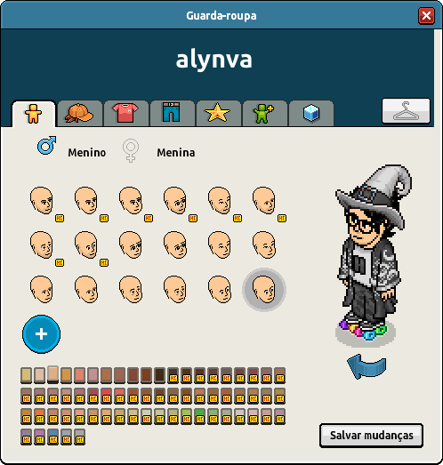

# **Habbo Avatar Figure Notation (HAFN) v2.0**

- **Specification Status:** Draft  
- **Date:** 2025-04-17
- **Available in:** English

<details><summary>Table of Contents</summary>
<div class="js-toc"></div>
</details>

## **1. Introduction**

### **1.1. Abstract**

**Habbo Avatar Figure Notation (HAFN) v2** is a standard for the text-based string notation designed to represent **Habbo avatar appearances** using compact, dot-separated codes. Each string encodes structured data that represents **figure parts, set IDs, and optional color IDs**, and it is based on the data exposed by the `figuredata` currently available.

While HAFN v2 reflects how avatar figures are encoded in Habbo URLs and backend systems, it is **not an official Sulake notation**, and future changes may not be adopted by Sulake.

<div align=center></div>

### **1.2. Scope and Intent**

#### **1.2.1. This Document**

This specification exists to formalize and document how Habbo encodes **avatar figure strings** for rendering and customization purposes. It is:

- **An unofficial community-maintained specification**.
- Intended for developers and hobbyists building **tools, visualizers, renderers, and archives** for Habbo avatars.
- Based on **publicly available `figuredata` files**.

#### **1.2.2. The Notation**

HAFN v2 is a textual representation of avatar configuration that enables:

- Compact **single-line storage** of figure appearance.
- Easy **parsing, generation, and validation** of figure strings.

It **DOES NOT** include aditional elements such as avatar actions and visual effects, as described in [Section 9](#9-additional-elements).

### **1.3. Audience**

This document is aimed at developers, archivists, modders, and enthusiasts in the Habbo community working on avatar-related tools and experiences. Familiarity with string manipulation and XML parsing (for reading `figuredata`) is recommended.

---

## **2. Status of This Document**

HAFN v2.0 defines the current known structure of Habbo avatar strings, based on the parsing behavior seen in Habbo Hotel and customizable through the `figuredata` file.

HAFN is **community-maintained**. While it matches current usage patterns, Sulake may change the format at any time. Future extensions will aim to preserve backward compatibility whenever possible.

---

## **3. Normative Language**

The key words "MUST", "MUST NOT", "REQUIRED", "SHALL", "SHALL NOT", "SHOULD", "SHOULD NOT", "RECOMMENDED", "MAY", and "OPTIONAL" in this document are to be interpreted as described in [RFC 2119](https://datatracker.ietf.org/doc/html/rfc2119).

---

## **4. Conformance**

An implementation is considered HAFN v2.0 compliant if it adheres to the syntax, validation logic, and resolution rules defined in this document. A conforming parser implementation:

- **MUST** resolve part types, set IDs, and color IDs using a valid `figuredata` structure.
- **MUST** reject any strings or identifiers not present in the current `figuredata`.
- **MAY** extend functionality through non-official extensions, provided they **DO NOT** interfere with the core compliance.

A valid HAFN v2.0 string **MUST**:

1. Follow the syntax definition in [Section 5](#5-syntax-definition).
2. Reference only known part types, set IDs, and color IDs defined in `figuredata`.
3. Be fully validated before processing to avoid undefined or malformed avatar configurations.

---

## **5. Syntax Definition**

### **5.1. Overview**

An HAFN v2 string encodes the **full appearance of a Habbo avatar**. It consists of multiple **figure parts**, separated by dots (`.`). Each part encodes a **type**, **set ID**, and up to **two color IDs**.

### **5.2. Grammar**

The following Extended Backus-Naur Form (EBNF) defines the syntax of HAFN v2.0:

```ebnf
<figure>    ::= <part> ("." <part>)*
<part>      ::= <type> "-" <setId> [ "-" <colorId1> [ "-" <colorId2> ] ]
<type>      ::= "hr" | "hd" | "ch" | "lg" | "sh" | "ea" | "cc" | ... ; (see figuredata)
<setId>     ::= <positiveInteger>
<colorId1>  ::= <positiveInteger>
<colorId2>  ::= <positiveInteger>
```

### **5.3. Lexical Constraints**

| Field        | Type     | Description                                                                 |
|--------------|----------|-----------------------------------------------------------------------------|
| `type`       | String   | A valid **part type** as defined in `figuredata`                            |
| `setId`      | Integer  | A valid **set ID** belonging to the specified part type                     |
| `colorId1`   | Integer  | A valid **first color ID** (**MAY** be required depending on the part)      |
| `colorId2`   | Integer  | A valid **second color ID**, **OPTIONAL** (for parts with two color layers) |

Each part **MUST** match an existing `set` entry in the `figuredata` file under the corresponding `<settype type="...">`.

### **5.4. Regular Expression (Simplified)**

The following regular expression can be used to validate the general structure of an HAFN v2.0 string:

```regex
(?:[a-z]{2}-\d+(?:-\d+(?:-\d+)?)?)(?:\.(?:[a-z]{2}-\d+(?:-\d+(?:-\d+)?)?))*

```

---

## **6. Processing Model**

### **6.1. Dot-separated Parts**

Each part is separated by a **dot (`.`)**. The parser **MUST**:

- Split on `.` to extract individual parts
- Split each part by `-` to determine its type, set ID, and optional colors
- Validate the part type and set ID using a current `figuredata` structure

### **6.2. Validation Rules**

- **Part types** **MUST** exist in `figuredata` under `<settype type="...">`
- **Set IDs** **MUST** be valid for the specified type
- **Color IDs** **MUST** be present in the `paletteid` referenced by that part's set definition

### **6.3. Optional Components**

- Some parts **MAY** omit color IDs entirely.
- Others **REQUIRE** one or two color IDs, depending on the set definition.
- Parts **MAY** appear in any order, though some systems might enforce or expect a typical order.

### **6.4. Error Handling**

| Error Code               | Description                                                    |
|--------------------------|----------------------------------------------------------------|
| **ERR_UNKNOWN_TYPE**     | `type` not found in current `figuredata`                       |
| **ERR_INVALID_SETID**    | Set ID not defined for given type                              |
| **ERR_INVALID_COLOR**    | Color ID not valid for palette used in set                     |
| **ERR_FORMAT_SYNTAX**    | Missing `-`, bad delimiter use, invalid part format            |
| **ERR_PART_INCOMPLETE**  | Missing required set ID or color ID                            |

An HAFN-compliant parser **MUST** reject invalid strings and report an appropriate error.

---

## **7. Example Entries**

### **7.1. Basic Example**

Consider the following example HAFN v2.0 string:

```txt
hr-890-45.hd-600-10.ch-665-1408.lg-716-1408-1408
```


**Explanation:**

- `hr-890-45` → Hair, set ID 890, color 45  
- `hd-600-10` → Head, set ID 600, color 10  
- `ch-665-1408` → Shirt (chest), set 665, color 1408  
- `lg-716-1408-1408` → Pants (legs), set 716, dual color 1408  

### **7.2. Complete Example**

The avatar could have way more parts defined:

```txt
hr-802-37.hd-180-1.ch-3030-1408.lg-3023-64.sh-3068-1408-64.ea-1403-1408.cc-3280-64-1408.cp-3284-64
```


**Explanation:**

- `hr-802-37` → Hair, set ID 802, color 37  
- `hd-180-1` → Head, set ID 180, color 1  
- `ch-3030-1408` → Shirt, set 3030, color 1408  
- `lg-3023-64` → Pants, set 3023, color 64  
- `sh-3068-1408-64` → Shoes, set 3068, primary color 1408, secondary 64  
- `ea-1403-1408` → Glasses, set 1403, color 1408  
- `cc-3280-64-1408` → Coat, set 3280, primary color 64, secondary 1408  
- `cp-3284-64` → Print, set 3284, color 64  

### **7.3. Other Examples**

    

---

## **8. Additional Elements**

There are other aspects related to the avatar figure that are **not** covered by this specification, such as clothing items that uses multiple parts, avatar actions (e.g., laying, sitting, waving, dancing), and visual effects. These elements are not present in the notation itself and should be considered as purely **informative** in this document, they do **not** define or alter the notation in any way.

Below are links to relevant data sources used to compute or render these elements. Further documentation may be written to explain them in more detail:

- [`figuremap.xml`](https://images.habbo.com/gordon/flash-assets-PRODUCTION-202502041750-974842909/figuremap.xml)
- [`HabboAvatarActions.xml`](https://images.habbo.com/gordon/flash-assets-PRODUCTION-202502041750-974842909/HabboAvatarActions.xml)
- [`effectmap.xml`](https://images.habbo.com/gordon/flash-assets-PRODUCTION-202502041750-974842909/effectmap.xml)

---

## **9. Extensibility and Future Work**

Future versions MAY include:

1. Support for **unknown part types** with fallback rendering
2. **Named sets** or mapping helpers for user-friendly representations
3. A **compressed or tokenized version** of the figure string for use in URLs

Revisions to the specification **SHALL** be versioned appropriately, and backward compatibility **MAY** be maintained where possible.

---

## **10. Security Considerations**

Although HAFN v2 is a textual notation and **does not execute code**, implementations **MUST** sanitize and validate input strings rigorously to prevent issues such as:

- Buffer overflows
- Injection attacks
- Improper rendering due to malformed input

> [!IMPORTANT]  
> HAFN v2 strings **do not verify clothes or color ownership**. They represent **appearance only** and should not be used to enforce access or ownership of figure parts.

Strict adherence to the syntax and processing guidelines is required for safe implementation.

---

## **11. References**

- *[Habbo `figuredata` XML](https://www.habbo.com/gamedata/figuredata/1)*
- *[Habbo Avatar Render Service](https://www.habbo.com.br/habbo-imaging/avatarimage?user=alynva&direction=2&head_direction=3&gesture=sml&action=wlk,crr=1&size=b)*
- *[Habbo Imager by the fan site "Pixels Emotions"](https://pixelsemotion.tumblr.com/habbo-imager)*
- *[Figure Editor by the fan site "Habbo News"](https://www.habbonews.net/p/habbo-visuais.html)*

---

### **Changelog**

- **v2.0.0 – 2025-04-07**
  - Initial draft of the Habbo Avatar Figure Notation (HAFN) specification.
- **v2.0.1 – 2025-04-08**
  - Initial draft of the adicional elements section.
- **v2.0.2 – 2025-04-12**
  - Minor touches of the draft.
- **v2.0.3 – 2025-04-13**
  - Migrated from `v1` to `v2` to let the `v1` be the numeric-based notation.
- **v2.0.4 - 2025-04-14**
  - Added the wardrobe image.
  - Completed the example section.
  - Minor touches of the draft.
- **v2.0.5 - 2025-04-17**
  - Standardizing the spec structure.
  - Completed the conformance section.
  - Added the 'Regular Expression' section.
  - Moved the 'Error Handling' section to within the 'Processing Model' section.
  - Minor touches of the draft.
