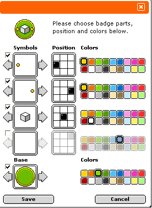

# **Habbo Group Badge Notation (HGBN) v1.0**

- **Specification Status:** Draft
- **Date:** 2025-04-18
- **Available in:** English

<details><summary>Table of Contents</summary>
<div class="js-toc"></div>
</details>

## **1. Introduction**

### **1.1. Abstract**

**Habbo Group Badge Notation (HGBN) v1** is a standard for the text-based notation designed to represent group badges within the Habbo ecosystem. It encodes structured badge data as a single string composed of multiple six-character segments. Each segment defines either a base image asset or a symbol overlay, including data about the asset id, tint color, and its placement on a 3×3 grid.

While HGBN v1 reflects the badge design definition, it is not an official format maintained by Sulake. Future updates or extensions may not be adopted by the company.

<div align="center">
  
</div>

### **1.2. Scope and Intent**

#### **1.2.1. This Document**

This specification exists to formalize and document how Habbo Hotel processes **group badge components**. It is:

- **An unofficial specification**, meaning Sulake may not adopt updates.
- **Meant for documentation and interoperability**, allowing developers to parse, generate, and manipulate group badges outside the game.

HGBN is **not a standard maintained by Sulake**, and its future extensions **MAY NOT** be reflected in the game's implementation.

#### **1.2.2. The Notation**

HGBN v1 is a textual representation of layered symbols that enables:

- **Storing badge configurations** as a compact text string
- **Programmatic parsing and generation** by developers and researchers
- Facilitating the **interoperability** of tools that render, manipulate, or analyze Habbo group badges

### **1.3. Audience**

This specification is intended for developers, researchers, archivists, and enthusiasts involved in the Habbo Hotel community, particularly those working on tools for Habbo group badges. It also serves as a common reference for understanding, implementing, and manipulating the Habbo Group Badge Notation (HGBN), which can be used for tasks such as developing interoperable software, emulators, and documentation for fan-driven projects. The audience also includes data scientists who may utilize this notation in image-related research or analysis. Familiarity with basic programming concepts, string manipulation, and image manipulation is recommended but not required.

---

## **2. Status of This Document**

HGBN v1.0 defines the known structure for how group badge designs used to be stored, based on the original implementation in Habbo Hotel.

HAFN is **community-maintained**. While efforts are made to ensure accuracy, Sulake may change the format at any time. Future extensions will aim to preserve backward compatibility whenever possible.

---

## **3. Normative Language**

The key words "MUST", "MUST NOT", "REQUIRED", "SHALL", "SHALL NOT", "SHOULD", "SHOULD NOT", "RECOMMENDED", "MAY", and "OPTIONAL" in this document are to be interpreted as described in [RFC 2119](https://datatracker.ietf.org/doc/html/rfc2119).

---

## **4. Conformance**

An implementation is considered HGBN v1.0 compliant if it adheres to the syntax, processing rules, and constraints defined in this document. A conforming parser implementation:

- **MUST** support at least one base segment followed by one or more symbol segments.
- **MUST** reject badge strings that violate structural rules or value constraints.
- **MAY** extend functionality through non-official extensions, provided they **DO NOT** interfere with the core compliance.

A valid HGBN string **MUST**:

1. Follow the syntax definition in [Section 5](#5-syntax-definition).
2. Use correct data formatting (segment identifiers, fixed-length numbers, and position digits).
3. Ensure that the asset ids and color ids are exactly two digits each, and the position is a single digit representing a 3×3 grid value (or `X` for the base).

---

## **5. Syntax Definition**

### **5.1. Overview**

A HGBN v1 string represents a complete badge by concatenating multiple six-character segments. The string is always ordered starting with the asset that should be at the bottom (base, identified by `b`), followed by the assets on top (symbols, identified by `s`).

> ![NOTE]
> The trailing hash in the file name (e.g., `b01bfc395d8c4be707922c3da5b3f561`) is probably used for image caching and security and is **ignored in the notation specification**.

### **5.2. Grammar**

The following Extended Backus-Naur Form (EBNF) defines the syntax of HGBN v1.0:

```ebnf
<hgbn>           ::= <baseSegment><symbolSegment>+
<baseSegment>    ::= "b"<assetId><colorId><basePosition>
<symbolSegment>  ::= <symbolType><assetId><colorId><position>
<symbolType>     ::= "s"
<assetId>        ::= <digit><digit>
<colorId>        ::= <digit><digit>
<basePosition>   ::= "X"
<position>       ::= <gridDigit>
<digit>          ::= "0" | "1" | "2" | "3" | "4" | "5" | "6" | "7" | "8" | "9"
<gridDigit>      ::= "1" | "2" | "3" | "4" | "5" | "6" | "7" | "8" | "9"****
```

### **5.3. Lexical Constraints**

| Field       | Type      | Format                    | Description                                                                              |
|-------------|-----------|---------------------------|------------------------------------------------------------------------------------------|
| `segmentId` | Character | `b`, or `s`               | `b` indicates a base segment; `s` indicates a symbol segment.                            |
| `assetId`   | Integer   | Two digits (00-99)        | Identifier for the image asset.                                                          |
| `colorId`   | Integer   | Two digits (00-99)        | Color tint identifier for the asset.                                                     |
| `position`  | Integer   | One digit (1-9)           | Position on a 3×3 grid where the element is placed.                                      |

### **5.4. Regular Expression (Simplified)**

The following regular expression can be used to validate the general structure of an HGBN v1.0 string:

```regex
/^(b\d{2}\d{2}X)((s|t)\d{2}\d{2}[1-9]){0,4}$/
```

---

## **6. Processing Model**

### **6.1. Badge Composition Semantics**

- The **base segment** is the foundation for the badge and **MUST** appear as the first segment.
- **Symbol segments** **MUST** be layered on top of the base in the order they appear in the string.
- The order of symbols affects rendering, with earlier symbols possibly appearing underneath later ones.

### **6.2. Rendering Considerations**

- The **assetId** corresponds to a specific image asset stored in the system.
- The **colorId** instructs how the asset image is tinted. Uncolorable portions (mask) of the asset remain unchanged.
- The **position** value, within a 3×3 grid (positions 1-9), determines where the asset is placed. Implementations **MUST** render the asset at the corresponding grid cell. The asset **MUST NOT** overflow the badge area. The base element has the `X` position to represent that its position MUST NOT be changed.

### **6.3. Error Handling**

| Error Code                 | Description                                                 |
|----------------------------|-------------------------------------------------------------|
| **ERR_ASSET_ID_RANGE**     | `assetId` is not a two-digit number between 00 and 99.      |
| **ERR_COLOR_ID_RANGE**     | `colorId` is not a two-digit number between 00 and 99.      |
| **ERR_INVALID_POSITION**   | `position` is not a digit between 0 and 8.                  |
| **ERR_SYNTAX**             | The badge string is missing required segments or delimiters.|

An HGBN-compliant parser **MUST** reject invalid strings and report an appropriate error.

---

## **7. Example Entries**

### **7.1. Basic Example**

Consider the following example HGBN v1.0 string (without the trailing hash):

```txt
b1001Xs05175s05173s12114
```

[](https://web.archive.org/web/20070528063549/http://www.habbo.com.br:80/groups/2/id)

**Explanation:**

- `b1001X` → Base with asset id `10`, color id `01`, at grid position `X`.
- `s05175` → Symbol with asset id `05`, color id `17`, at grid position `5`.
- `s05173` → Symbol with asset id `05`, color id `17`, at grid position `3`.
- `s12114` → Symbol with asset id `12`, color id `11`, at grid position `4`.

### **7.2. Complete Example**

A badge without the base could be specified as:

```txt
s44114s04115s04113s05074
```

[](https://web.archive.org/web/20070707083821/http://www.habbo.com.br/groups/258/id)

**Explanation:**

- `s44114` → Symbol with asset id `44`, color id `11`, at grid position `4`.
- `s04115` → Symbol with asset id `04`, color id `11`, at grid position `5`.
- `s04113` → Symbol with asset id `04`, color id `11`, at grid position `3`.
- `s05074` → Symbol with asset id `05`, color id `07`, at grid position `4`.

### **7.3. Other Examples**

      

---

## **8. Extensibility and Future Work**

Possible future extensions of HGBN **MAY** include:

1. **Additional Segment Types:** More identifiers beyond `b`, and `s` to support new features.
2. **Expanded Ranges:** Extending the ranges of asset ids or color ids for upcoming visual designs.
3. **Positional Enhancements:** Defining more granular placements or layering priorities beyond the basic 3×3 grid.

Revisions to the specification **SHALL** be versioned appropriately, and backward compatibility **MAY** be maintained where possible.

---

## **9. Security Considerations**

Although HGBN is a textual notation and does not execute code, implementations **MUST** sanitize and validate input strings rigorously to prevent issues such as:

- Buffer overflows
- Injection attacks
- Improper rendering due to malformed input

Strict adherence to the syntax and processing guidelines is required for safe implementation.

---

## **10. Reference Tables for Group Badge Assets**

### **10.1. Base Assets**

> Not available

### **10.2. Symbol Assets**

> Not available

### **10.3. Color IDs and Tints**

> Not avaliable

### **10.4. Grid Positions**

| **Position Id** | **Grid Cell**    |
|-----------------|------------------|
| 1               | Top-left         |
| 2               | Top-center       |
| 3               | Top-right        |
| 4               | Middle-left      |
| 5               | Center           |
| 6               | Middle-right     |
| 7               | Bottom-left      |
| 8               | Bottom-center    |
| 9               | Bottom-right     |

---

## **11. References**

- *[Archived Habbo Home of `Kinas` from `hhbr`](https://web.archive.org/web/20071202125328/http://www.habbo.com.br/home/Kinas)*
- *[Archived Group Page of `puppaplaah` from `hhbr`](https://web.archive.org/web/20070528063549/http://www.habbo.com.br:80/groups/2/id)*
- *[Habbo Group Badge Render Service](https://www.habbo.com.br/habbo-imaging/badge/s44114s04115s04113s050748b83f03d75ff6d0821178373f43bde29.png) (also avaliable as `.gif` and from `badge-fill` for non-transparent background)*

---

### **Changelog**

- **v1.0.0 - 2025-04-10**
  - Initial draft of the HGBN specification.
- **v1.0.1 - 2025-04-12**
  - Updating to reflect old badges.
- **v1.0.2 - 2025-04-17**
  - Standardizing the spec structure.
  - Minor touches of the draft.
- **v1.0.3 - 2025-04-18**
  - Minor grammar fixes.
