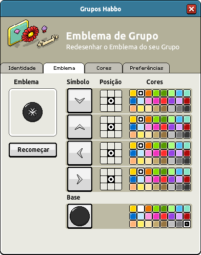

# **Habbo Group Badge Notation (HGBN) v1.1**

- **Specification Status:** Candidate
- **Date:** 2025-05-02
- **Available in:** [Inglés (original)](./HGBN-v1_1.md) • [Portugués](./HGBN-v1_1-br.md) • Español

> [!NOTE] Nota
> Este documento es una traducción [del original](./HGBN-v1_1.md). Si observas inconsistencias con el contenido del juego en este idioma, por favor, [avísanos](https://github.com/Habbianos/notations/issues/new/choose) para que podamos corregir la localización.

<details><summary>Índice</summary>
<div class="js-toc"></div>
</details>

## **1. Introducción**

### **1.1. Resumen**

**Habbo Group Badge Notation (HGBN) v1** es un estándar para la notación basada en texto diseñado para representar **insignias de grupo dentro del ecosistema Habbo**. HGBN codifica datos estructurados de insignias como una única cadena compuesta por múltiples segmentos de seis caracteres. Cada segmento define ya sea un recurso de imagen base o una superposición de símbolo, incluyendo datos sobre el ID del recurso, el ID de color y su posición en una cuadrícula 3×3.

Aunque HGBN v1 refleja la definición actual del diseño de insignias, **no es un formato oficial mantenido por Sulake**, y futuras actualizaciones o extensiones **PUEDEN NO** ser adoptadas por la empresa.

<div align="center">
  
</div>

### **1.2. Alcance y Objetivo**

#### **1.2.1. Este Documento**

Esta especificación existe para formalizar y documentar cómo Habbo Hotel procesa **componentes de insignias de grupo**. Está dirigida a:

- **Una especificación no oficial**, lo que significa que Sulake puede no adoptar las actualizaciones.
- **Destinada a documentación e interoperabilidad**, permitiendo que desarrolladores analicen, generen y manipulen insignias de grupo fuera del juego.

HGBN **no es un estándar mantenido por Sulake**, y sus extensiones futuras **PUEDEN NO** reflejarse en la implementación del juego.

#### **1.2.2. La Notación**

HGBN v1 es una representación textual de símbolos en capas diseñada para:

- **Almacenar configuraciones de insignias** como una cadena de texto compacta
- **Análisis y generación programática** por desarrolladores e investigadores
- Facilitar la **interoperabilidad** de herramientas que representen, manipulen o analicen insignias de grupo de Habbo

### **1.3. Audiencia**

Esta especificación está dirigida a desarrolladores, investigadores, archivistas y entusiastas de la comunidad de Habbo Hotel, particularmente aquellos que trabajan en herramientas para insignias de grupo de Habbo. También sirve como referencia común para comprender, implementar y manipular la Notación de Insignias de Grupo de Habbo (HGBN), que puede usarse en tareas como el desarrollo de software interoperable, emuladores y documentación para proyectos de fans. El público también incluye científicos de datos que puedan utilizar esta notación en investigaciones o análisis relacionados con imágenes. Se recomienda, pero no es obligatorio, familiaridad con conceptos básicos de programación, manipulación de cadenas y manipulación de imágenes.

---

## **2. Estado de este Documento**

HGBN v1.1 define la estructura actualmente conocida de cómo se almacenan los diseños de insignias de grupo, basada en la implementación original en Habbo Hotel.

HGBN es **mantenido por la comunidad**. Aunque se realizan esfuerzos para garantizar la precisión, Sulake puede cambiar el formato en cualquier momento. Futuras extensiones intentarán preservar la retrocompatibilidad siempre que sea posible.

---

## **3. Lenguaje Normativo**

Las palabras clave "DEBE", "NO DEBE", "OBLIGATORIO", "DEBERÁ", "NO DEBERÁ", "RECOMENDADO", "PUEDE" y "OPCIONAL" en este documento deben interpretarse según lo descrito en [RFC 2119](https://datatracker.ietf.org/doc/html/rfc2119).

---

## **4. Conformidad**

Una implementación se considera conforme con HGBN v1.1 si sigue la sintaxis, las reglas de procesamiento y las restricciones definidas en este documento. Un analizador (parser) conforme:

- **DEBE** soportar al menos un segmento base seguido de uno o más segmentos de símbolo.
- **DEBE** rechazar cadenas de insignia que violen las reglas estructurales o las restricciones de valor.
- **PUEDE** extender la funcionalidad mediante extensiones no oficiales, siempre que **NO INTERFIERAN** con la conformidad central.

Una cadena HGBN válida **DEBE**:

1. Seguir la definición de sintaxis en la [Sección 5](#5-definición-de-sintaxis).
2. Utilizar el formato de datos correcto (identificadores de segmento, números de longitud fija y dígitos de posición).
3. Asegurar que los asset IDs y los color IDs tengan exactamente dos dígitos cada uno, y que la posición sea un único dígito que represente un valor en una cuadrícula 3×3.

---

## **5. Definición de Sintaxis**

### **5.1. Visión General**

Una cadena HGBN v1 representa un emblema completo concatenando múltiples segmentos de seis caracteres. La cadena siempre comienza con el recurso que debe estar en la base (identificado por `b`), seguido por los recursos superiores (símbolos, identificados por `s` o `t`).

> [!NOTE] Nota
> El hash final en el nombre de archivo (por ejemplo, `b01bfc395d8c4be707922c3da5b3f561`) probablemente se usa para caché y seguridad de imágenes, y **se IGNORA en la especificación de notación**.

### **5.2. Gramática**

La siguiente Forma de Backus‑Naur Extendida (EBNF) define la sintaxis de HGBN v1.1:

```ebnf
<hgbn>           ::= <baseSegment><symbolSegment>+
<baseSegment>    ::= "b"<assetId><colorId><position>
<symbolSegment>  ::= <symbolType><assetId><colorId><position>
<symbolType>     ::= "s" | "t"
<assetId>        ::= <digit><digit>
<colorId>        ::= <digit><digit>
<position>       ::= <gridDigit>
<digit>          ::= "0" | "1" | "2" | "3" | "4" | "5" | "6" | "7" | "8" | "9"
<gridDigit>      ::= "0" | "1" | "2" | "3" | "4" | "5" | "6" | "7" | "8"
```

### **5.3. Restricciones Léxicas**

| Campo       | Tipo     | Formato             | Descripción                                                     |
| ----------- | -------- | ------------------- | --------------------------------------------------------------- |
| `segmentId` | Carácter | `b`, `s` o `t`      | `b` indica segmento base; `s` o `t` indica segmento de símbolo. |
| `assetId`   | Entero   | Dos dígitos (00–99) | Identificador del recurso de imagen.                            |
| `colorId`   | Entero   | Dos dígitos (00–99) | Identificador de la tonalidad de color para el recurso.         |
| `position`  | Entero   | Un dígito (0–8)     | Posición en una cuadrícula 3×3 donde se coloca el elemento.     |

### **5.4. Expresión Regular (Simplificada)**

La siguiente expresión regular puede usarse para validar la estructura general de una cadena HGBN v1.1:

```regex
/^(b\d{2}\d{2}[0-8])((s|t)\d{2}\d{2}[0-8]){0,4}$/
```

---

## **6. Modelo de Procesamiento**

### **6.1. Semántica de Composición de Insignias**

- El **segmento base** es la base de la insignia y **DEBE** aparecer como el primer segmento.
- Los **segmentos de símbolo** **DEBEN** superponerse sobre el segmento base en el orden en que aparecen en la cadena.
- El orden de los símbolos afecta la renderización, ya que los símbolos anteriores pueden aparecer debajo de los posteriores.

### **6.2. Consideraciones de Renderización**

- El **assetId** corresponde a un recurso de imagen específico almacenado en el sistema.
- El **colorId** indica cómo se debe teñir la imagen del recurso. Las porciones no coloreables (máscara) del recurso permanecen sin cambios.
- El valor de **posición**, dentro de una cuadrícula 3×3 (posiciones 0–8), determina dónde se coloca el recurso. Las implementaciones **DEBEN** renderizar el recurso en la celda correspondiente de la cuadrícula. El recurso **NO DEBE** desbordar el área de la insignia.

### **6.3. Manejo de Errores**

| Código de Error             | Descripción                                                   |
|-----------------------------|---------------------------------------------------------------|
| **ERR_ASSET_ID_RANGE**      | `assetId` no es un número de dos dígitos entre 00 y 99.       |
| **ERR_COLOR_ID_RANGE**      | `colorId` no es un número de dos dígitos entre 00 y 99.       |
| **ERR_INVALID_POSITION**    | `position` no es un dígito entre 0 y 8.                       |
| **ERR_SYNTAX**              | Falta segmentos o delimitadores requeridos en la cadena.      |

Un parser conforme con HGBN **DEBE** rechazar cadenas inválidas y reportar el error apropiado.

---

## **7. Ejemplaciones**

### **7.1. Ejemplo Básico**

Considere la siguiente cadena HGBN v1.1 (sin el hash final):

```txt
b12134s47114s46114s48114s45114
```

[](https://www.habbo.com.br/api/public/groups/g-hhbr-d5c67dd48b87d8b62f5a6a14ebbf4d8d)

**Explicación:**

- `b12134` → Base con asset id `12`, color id `13`, en la posición de cuadrícula `4`.
- `s47114` → Símbolo con asset id `47`, color id `11`, en la posición de cuadrícula `4`.
- `s46114` → Símbolo con asset id `46`, color id `11`, en la posición de cuadrícula `4`.
- `s48114` → Símbolo con asset id `48`, color id `11`, en la posición de cuadrícula `4`.
- `s45114` → Símbolo con asset id `45`, color id `11`, en la posición de cuadrícula `4`.

### **7.2. Ejemplo Completo**

Una insignia con tipos de símbolo `s` y `t` podría especificarse así:

```txt
b12063s78110t00118t27114
```

[](https://www.habbo.com.br/api/public/groups/g-hhbr-77d66c05a0d7373a02f17f0cd937115c)

**Explicación:**

- `b12063` → Base con asset id `12`, color id `06`, en la posición de cuadrícula `3`.
- `s78110` → Símbolo con asset id `78`, color id `11`, en la posición de cuadrícula `0`.
- `t00118` → Símbolo con asset id `00` (tipo `t`), color id `11`, en la posición de cuadrícula `8`.
- `t27114` → Símbolo con asset id `27` (tipo `t`), color id `11`, en la posición de cuadrícula `4`.

### **7.3. Otros Ejemplos**

      

---

## **8. Extensibilidad y Trabajos Futuros**

Posibles extensiones futuras de HGBN **PUEDEN** incluir:

1. **Tipos de Segmento Adicionales:** Más identificadores además de `b`, `s` y `t` para soportar nuevas funcionalidades.
2. **Intervalos Expandibles:** Extensión de los rangos de asset IDs o color IDs para futuros diseños visuales.
3. **Mejoras Posicionales:** Definición de posicionamientos más granulares o prioridades de superposición más allá de la cuadrícula básica 3×3.

Las revisiones de la especificación **DEBERÁN** versionarse adecuadamente, y la retrocompatibilidad **PUEDEN** mantenerse cuando sea posible.

---

## **9. Consideraciones de Seguridad**

Aunque HGBN es una notación textual y **no ejecuta código**, las implementaciones **DEBEN** sanitizar y validar rigurosamente las cadenas de entrada para prevenir:

- Desbordamientos de búfer
- Ataques de inyección
- Renderización incorrecta debido a entradas malformadas

La estricta adherencia a la sintaxis y a las directrices de procesamiento es requerida para una implementación segura.

---

## **10. Referencias**

- [1] *API de Grupos de Habbo*, Habbo.com.br. Disponible en: [https://www.habbo.com.br/api/public/groups/g-hhbr-d5c67dd48b87d8b62f5a6a14ebbf4d8d](https://www.habbo.com.br/api/public/groups/g-hhbr-d5c67dd48b87d8b62f5a6a14ebbf4d8d)
- [2] *Servicio de Renderizado de Insignias de Grupo de Habbo*, Habbo.com.br. Disponible en: [https://www.habbo.com.br/habbo-imaging/badge/b12134s47114s46114s48114s45114f6bbe1ccfa2e8dd23d17c70895929672.png](https://www.habbo.com.br/habbo-imaging/badge/b12134s47114s46114s48114s45114f6bbe1ccfa2e8dd23d17c70895929672.png) (también disponible en formato `.gif` y mediante la variante `badge-fill` para fondos no transparentes)

---

## **11. Colaboradores**

Este documento fue desarrollado con contribuciones de:

- **[Alisson Nunes, "alynva"](https://alynva.com)**: Autor principal
- **[Matheus, "ferrazmatheus"](https://x.com/ImFerraz_)**: Investigación

---

## **12. Registro de Cambios**

- **v1.1.0 – 2025‑04‑12**
  - Actualización desde `v1.0` con nueva información encontrada.
  - Llenado de las tablas de referencia.
  - Corrección de los IDs de posición con índice cero.
  - Ajustes menores del borrador.
- **v1.1.1 – 2025‑04‑17**
  - Estandarización de la estructura de la especificación.
  - Ajustes menores del borrador.
- **v1.1.2 – 2025‑04‑18**
  - Correcciones gramaticales menores.
- **v1.1.3 - 2025-05-02**
  - Corrección de la etiqueta de alerta de Markdown.
  - Sección de colaboradores añadidos.
  - Reorganizando las últimas secciones y renombrando la Tabla de Referencias a Apéndices.

---

## **13. Apéndices**

Las siguientes tablas enumeran los mapeos de activos aprobados. Los implementadores y desarrolladores pueden usar estas tablas como referencia para renderizar componentes de insignias. Las tablas están ordenadas por nombre de activo; el “índice” indica la posición en la lista del juego, seguido de `fila × columna` para facilitar la navegación.

### **13.1. Apéndice A. Insignias de Grupo Activos Base**

| Prefijo de Notación | ID de Notación | ID de Activo | Nombre de Activo ▲ | Índice de Activo | ¿Tiene Máscara? | Imagen Colorizable                                                                                    | Imagen de Máscara                                                                                     |
|---------------------|----------------|--------------|--------------------|------------------|-----------------|-------------------------------------------------------------------------------------------------------|-------------------------------------------------------------------------------------------------------|
| `b`                 | `06`           | 6            | advanced_1         | 6º (2x2)         | No              |              |                                                                                                       |
| `b`                 | `07`           | 7            | advanced_2         | 7º (2x3)         | No              |              |                                                                                                       |
| `b`                 | `08`           | 8            | advanced_3         | 8º (2x4)         | No              |              |                                                                                                       |
| `b`                 | `09`           | 9            | advanced_4         | 9º (2x5)         | No              |              |                                                                                                       |
| `b`                 | `01`           | 1            | basic_1            | 1º (1x2)         | No              |                    |                                                                                                       |
| `b`                 | `02`           | 2            | basic_2            | 2º (1x3)         | No              |                    |                                                                                                       |
| `b`                 | `03`           | 3            | basic_3            | 3º (1x4)         | No              |                    |                                                                                                       |
| `b`                 | `04`           | 4            | basic_4            | 4º (1x5)         | No              |                    |                                                                                                       |
| `b`                 | `05`           | 5            | basic_5            | 5º (2x1)         | No              |                    |                                                                                                       |
| `b`                 | `21`           | 65           | beams              | 21º (5x2)        | Sí              |            |            |
| `b`                 | `25`           | 118          | book               | 25º (6x1)        | No              |                          |                                                                                                       |
| `b`                 | `15`           | 15           | circles_1          | 15º (4x1)        | No              |                |                                                                                                       |
| `b`                 | `16`           | 16           | circles_2          | 16º (4x2)        | No              |                |                                                                                                       |
| `b`                 | `26`           | 119          | egg                | 26º (6x2)        | No              |                            |                                                                                                       |
| `b`                 | `10`           | 10           | gold_1             | 10º (3x1)        | Sí              |          |          |
| `b`                 | `11`           | 11           | gold_2             | 11º (3x2)        | Sí              |          |          |
| `b`                 | `13`           | 13           | gradient_1         | 13º (3x4)        | No              |              |                                                                                                       |
| `b`                 | `14`           | 14           | gradient_2         | 14º (3x5)        | No              |              |                                                                                                       |
| `b`                 | `19`           | 19           | misc_1             | 19º (4x5)        | Sí              |          |          |
| `b`                 | `20`           | 20           | misc_2             | 20º (5x1)        | No              |                      |                                                                                                       |
| `b`                 | `27`           | 120          | ornament           | 27º (6x3)        | No              |                  |                                                                                                       |
| `b`                 | `17`           | 17           | ornament_1         | 17º (4x3)        | Sí              |  |  |
| `b`                 | `18`           | 18           | ornament_2         | 18º (4x4)        | Sí              |  |  |
| `b`                 | `12`           | 12           | pin                | 12º (3x3)        | Sí              |                |                |
| `b`                 | `22`           | 66           | ring               | 22º (5x3)        | No              |                          |                                                                                                       |
| `b`                 | `28`           | 121          | shield             | 28º (6x4)        | Sí              |          |          |
| `b`                 | `23`           | 67           | simplestar         | 23º (5x4)        | Sí              |  |  |
| `b`                 | `24`           | 68           | spiral             | 24º (5x5)        | No              |                      |                                                                                                       |

### **13.2. Apéndice B. Insignias de Grupo Activos de Símbolo**

| Prefijo de Notación | ID de Notación | ID de Activo | Nombre de Activo ▲ | Índice de Activo | ¿Tiene Máscara? | Imagen Colorizable                                                                                                                       | Imagen de Máscara                                                                                                                        |
|---------------------|----------------|--------------|--------------------|------------------|-----------------|------------------------------------------------------------------------------------------------------------------------------------------|------------------------------------------------------------------------------------------------------------------------------------------|
| `s`                 | `68`           | 173          | 0                  | 119º (24x5)      | No              |                                            |                                                                                                                                          |
| `s`                 | `69`           | 174          | 1                  | 120º (25x1)      | No              |                                            |                                                                                                                                          |
| `s`                 | `70`           | 175          | 2                  | 121º (25x2)      | No              |                                            |                                                                                                                                          |
| `s`                 | `71`           | 176          | 3                  | 122º (25x3)      | No              |                                            |                                                                                                                                          |
| `s`                 | `72`           | 177          | 4                  | 123º (25x4)      | No              |                                            |                                                                                                                                          |
| `s`                 | `73`           | 178          | 5                  | 124º (25x5)      | No              |                                            |                                                                                                                                          |
| `s`                 | `74`           | 179          | 6                  | 125º (26x1)      | No              |                                            |                                                                                                                                          |
| `s`                 | `75`           | 180          | 7                  | 126º (26x2)      | No              |                                            |                                                                                                                                          |
| `s`                 | `76`           | 181          | 8                  | 127º (26x3)      | No              |                                            |                                                                                                                                          |
| `s`                 | `77`           | 182          | 9                  | 128º (26x4)      | No              |                                            |                                                                                                                                          |
| `s`                 | `78`           | 183          | a                  | 129º (26x5)      | No              |                                            |                                                                                                                                          |
| `t`                 | `04`           | 122          | alligator          | 68º (14x4)       | No              |                            |                                                                                                                                          |
| `t`                 | `05`           | 123          | americanfootball   | 69º (14x5)       | Sí              |  |  |
| `s`                 | `45`           | 69           | arrow_down         | 45º (10x1)       | No              |                          |                                                                                                                                          |
| `s`                 | `46`           | 70           | arrow_left         | 46º (10x2)       | No              |                          |                                                                                                                                          |
| `s`                 | `47`           | 71           | arrow_right        | 47º (10x3)       | No              |                        |                                                                                                                                          |
| `s`                 | `48`           | 72           | arrow_up           | 48º (10x4)       | No              |                              |                                                                                                                                          |
| `s`                 | `49`           | 73           | arrowbig_up        | 49º (10x5)       | No              |                        |                                                                                                                                          |
| `t`                 | `06`           | 124          | award              | 70º (15x1)       | Sí              |                        |                        |
| `s`                 | `50`           | 74           | axe                | 50º (11x1)       | Sí              |                            |                            |
| `s`                 | `79`           | 184          | b                  | 130º (27x1)      | No              |                                            |                                                                                                                                          |
| `s`                 | `01`           | 21           | background_1       | 1º (1x2)         | No              |                      |                                                                                                                                          |
| `s`                 | `02`           | 22           | background_2       | 2º (1x3)         | No              |                      |                                                                                                                                          |
| `s`                 | `03`           | 23           | background_3       | 3º (1x4)         | Sí              |          |          |
| `s`                 | `04`           | 24           | ball_1             | 4º (1x5)         | Sí              |                      |                      |
| `s`                 | `05`           | 25           | ball_2             | 5º (2x1)         | Sí              |                      |                      |
| `t`                 | `07`           | 125          | bananapeel         | 71º (15x2)       | No              |                          |                                                                                                                                          |
| `t`                 | `08`           | 126          | battleball         | 72º (15x3)       | No              |                          |                                                                                                                                          |
| `t`                 | `09`           | 127          | biohazard          | 73º (15x4)       | No              |                            |                                                                                                                                          |
| `t`                 | `10`           | 128          | bird               | 74º (15x5)       | No              |                                      |                                                                                                                                          |
| `t`                 | `11`           | 129          | bishop             | 75º (16x1)       | No              |                                  |                                                                                                                                          |
| `s`                 | `06`           | 26           | bobba              | 6º (2x2)         | No              |                                    |                                                                                                                                          |
| `s`                 | `07`           | 27           | bomb               | 7º (2x3)         | Sí              |                          |                          |
| `s`                 | `08`           | 28           | bow                | 8º (2x4)         | No              |                                        |                                                                                                                                          |
| `s`                 | `09`           | 29           | box_1              | 9º (2x5)         | No              |                                    |                                                                                                                                          |
| `s`                 | `10`           | 30           | box_2              | 10º (3x1)        | No              |                                    |                                                                                                                                          |
| `s`                 | `51`           | 75           | bug                | 51º (11x2)       | Sí              |                            |                            |
| `s`                 | `11`           | 31           | bunting_1          | 11º (3x2)        | No              |                            |                                                                                                                                          |
| `s`                 | `12`           | 32           | bunting_2          | 12º (3x3)        | No              |                            |                                                                                                                                          |
| `s`                 | `13`           | 33           | butterfly          | 13º (3x4)        | Sí              |                |                |
| `s`                 | `80`           | 185          | c                  | 131º (27x2)      | No              |                                            |                                                                                                                                          |
| `s`                 | `52`           | 76           | capsbig            | 52º (11x3)       | Sí              |                    |                    |
| `s`                 | `53`           | 77           | capssmall          | 53º (11x4)       | Sí              |                |                |
| `s`                 | `54`           | 78           | cloud              | 54º (11x5)       | No              |                                    |                                                                                                                                          |
| `t`                 | `12`           | 130          | coalion            | 76º (16x2)       | No              |                                |                                                                                                                                          |
| `t`                 | `13`           | 131          | cocoamug           | 77º (16x3)       | No              |                              |                                                                                                                                          |
| `s`                 | `14`           | 34           | cowskull           | 14º (3x5)        | Sí              |                  |                  |
| `t`                 | `14`           | 210          | credit             | 156º (32x2)      | Sí              |                      |                      |
| `s`                 | `15`           | 35           | cross              | 15º (4x1)        | No              |                                    |                                                                                                                                          |
| `s`                 | `55`           | 79           | crown              | 55º (12x1)       | Sí              |                        |                        |
| `s`                 | `81`           | 186          | d                  | 132º (27x3)      | No              |                                            |                                                                                                                                          |
| `t`                 | `15`           | 132          | dashflag           | 78º (16x4)       | No              |                              |                                                                                                                                          |
| `s`                 | `16`           | 36           | diamond            | 16º (4x2)        | No              |                                |                                                                                                                                          |
| `t`                 | `16`           | 133          | diamondring        | 79º (16x5)       | Sí              |            |            |
| `s`                 | `57`           | 81           | diamsmall          | 57º (12x3)       | No              |                            |                                                                                                                                          |
| `s`                 | `56`           | 80           | diamsmall2         | 56º (12x2)       | No              |                          |                                                                                                                                          |
| `s`                 | `17`           | 37           | diploma            | 17º (4x3)        | Sí              |                    |                    |
| `t`                 | `17`           | 134          | discoball          | 80º (17x1)       | Sí              |                |                |
| `t`                 | `18`           | 135          | dog                | 81º (17x2)       | No              |                                        |                                                                                                                                          |
| `s`                 | `58`           | 82           | drop               | 58º (12x4)       | No              |                                      |                                                                                                                                          |
| `s`                 | `82`           | 187          | e                  | 133º (27x4)      | No              |                                            |                                                                                                                                          |
| `t`                 | `19`           | 136          | electricguitarh    | 82º (17x3)       | Sí              |    |    |
| `t`                 | `20`           | 137          | electricguitarv    | 83º (17x4)       | Sí              |    |    |
| `s`                 | `18`           | 38           | eyeball            | 18º (4x4)        | Sí              |                    |                    |
| `s`                 | `83`           | 188          | f                  | 134º (27x5)      | No              |                                            |                                                                                                                                          |
| `t`                 | `21`           | 138          | film               | 84º (17x5)       | No              |                                      |                                                                                                                                          |
| `s`                 | `59`           | 83           | fingersheavy       | 59º (12x5)       | No              |                      |                                                                                                                                          |
| `s`                 | `60`           | 84           | fingersv           | 60º (13x1)       | No              |                              |                                                                                                                                          |
| `s`                 | `19`           | 39           | fist               | 19º (4x5)        | No              |                                      |                                                                                                                                          |
| `s`                 | `20`           | 40           | flame_1            | 20º (5x1)        | No              |                                |                                                                                                                                          |
| `s`                 | `21`           | 41           | flame_2            | 21º (5x2)        | No              |                                |                                                                                                                                          |
| `t`                 | `22`           | 139          | flame              | 85º (18x1)       | Sí              |                        |                        |
| `s`                 | `22`           | 42           | flash              | 22º (5x3)        | No              |                                    |                                                                                                                                          |
| `s`                 | `23`           | 43           | flower_1           | 23º (5x4)        | Sí              |                  |                  |
| `s`                 | `24`           | 44           | flower_2           | 24º (5x5)        | No              |                              |                                                                                                                                          |
| `s`                 | `25`           | 45           | flower_3           | 25º (6x1)        | No              |                              |                                                                                                                                          |
| `s`                 | `26`           | 46           | flower_4           | 26º (6x2)        | No              |                              |                                                                                                                                          |
| `s`                 | `27`           | 47           | football           | 27º (6x3)        | No              |                              |                                                                                                                                          |
| `s`                 | `84`           | 189          | g                  | 135º (28x1)      | No              |                                            |                                                                                                                                          |
| `t`                 | `23`           | 140          | gamepad            | 86º (18x2)       | No              |                                |                                                                                                                                          |
| `t`                 | `24`           | 141          | gem1               | 87º (18x3)       | Sí              |                          |                          |
| `t`                 | `25`           | 142          | gem2               | 88º (18x4)       | Sí              |                          |                          |
| `t`                 | `26`           | 143          | gem3               | 89º (18x5)       | Sí              |                          |                          |
| `s`                 | `61`           | 85           | gtr                | 61º (13x2)       | Sí              |                            |                            |
| `s`                 | `85`           | 190          | h                  | 136º (28x2)      | No              |                                            |                                                                                                                                          |
| `s`                 | `62`           | 86           | hat                | 62º (13x3)       | No              |                                        |                                                                                                                                          |
| `t`                 | `27`           | 144          | hawk               | 90º (19x1)       | No              |                                      |                                                                                                                                          |
| `t`                 | `58`           | 211          | hc                 | 157º (32x3)      | Sí              |                              |                              |
| `s`                 | `28`           | 48           | heart_1            | 28º (6x4)        | Sí              |                    |                    |
| `s`                 | `29`           | 49           | heart_2            | 29º (6x5)        | Sí              |                    |                    |
| `t`                 | `28`           | 145          | hearts_down        | 91º (19x2)       | No              |                        |                                                                                                                                          |
| `t`                 | `29`           | 146          | hearts_up          | 92º (19x3)       | No              |                            |                                                                                                                                          |
| `t`                 | `30`           | 147          | horseshoe          | 93º (19x4)       | No              |                            |                                                                                                                                          |
| `s`                 | `86`           | 191          | i                  | 137º (28x3)      | No              |                                            |                                                                                                                                          |
| `t`                 | `31`           | 148          | inksplatter        | 94º (19x5)       | No              |                        |                                                                                                                                          |
| `s`                 | `87`           | 192          | j                  | 138º (28x4)      | No              |                                            |                                                                                                                                          |
| `s`                 | `30`           | 50           | jingjang           | 30º (7x1)        | Sí              |                  |                  |
| `s`                 | `88`           | 193          | k                  | 139º (28x5)      | No              |                                            |                                                                                                                                          |
| `s`                 | `89`           | 194          | l                  | 140º (29x1)      | No              |                                            |                                                                                                                                          |
| `t`                 | `32`           | 149          | leaf               | 95º (20x1)       | No              |                                      |                                                                                                                                          |
| `s`                 | `31`           | 51           | lips               | 31º (7x2)        | Sí              |                          |                          |
| `s`                 | `90`           | 195          | m                  | 141º (29x2)      | No              |                                            |                                                                                                                                          |
| `t`                 | `33`           | 150          | micstand           | 96º (20x2)       | No              |                              |                                                                                                                                          |
| `t`                 | `34`           | 151          | mirror             | 97º (20x3)       | Sí              |                      |                      |
| `t`                 | `35`           | 152          | monkeywrench       | 98º (20x4)       | No              |                      |                                                                                                                                          |
| `s`                 | `91`           | 196          | n                  | 142º (29x3)      | No              |                                            |                                                                                                                                          |
| `s`                 | `32`           | 52           | note               | 32º (7x3)        | No              |                                      |                                                                                                                                          |
| `t`                 | `36`           | 153          | note1              | 99º (20x5)       | No              |                                    |                                                                                                                                          |
| `t`                 | `37`           | 154          | note2              | 100º (21x1)      | No              |                                    |                                                                                                                                          |
| `t`                 | `38`           | 155          | note3              | 101º (21x2)      | No              |                                    |                                                                                                                                          |
| `t`                 | `39`           | 156          | nursecross         | 102º (21x3)      | No              |                          |                                                                                                                                          |
| `s`                 | `92`           | 197          | o                  | 143º (29x4)      | No              |                                            |                                                                                                                                          |
| `s`                 | `63`           | 87           | oval               | 63º (13x4)       | Sí              |                          |                          |
| `s`                 | `93`           | 198          | p                  | 144º (29x5)      | No              |                                            |                                                                                                                                          |
| `s`                 | `64`           | 88           | pawprint           | 64º (13x5)       | No              |                              |                                                                                                                                          |
| `s`                 | `33`           | 53           | peace              | 33º (7x4)        | No              |                                    |                                                                                                                                          |
| `t`                 | `40`           | 157          | pencil             | 103º (21x4)      | Sí              |                      |                      |
| `t`                 | `41`           | 209          | pixel              | 155º (32x1)      | Sí              |                        |                        |
| `s`                 | `34`           | 54           | planet             | 34º (7x5)        | Sí              |                      |                      |
| `s`                 | `94`           | 199          | q                  | 145º (30x1)      | No              |                                            |                                                                                                                                          |
| `t`                 | `42`           | 158          | queen              | 104º (21x5)      | No              |                                    |                                                                                                                                          |
| `s`                 | `95`           | 200          | r                  | 146º (30x2)      | No              |                                            |                                                                                                                                          |
| `s`                 | `35`           | 55           | rainbow            | 35º (8x1)        | Sí              |                    |                    |
| `t`                 | `43`           | 159          | rock               | 105º (22x1)      | No              |                                      |                                                                                                                                          |
| `t`                 | `44`           | 160          | rook               | 106º (22x2)      | No              |                                      |                                                                                                                                          |
| `s`                 | `36`           | 56           | rosete             | 36º (8x2)        | No              |                                  |                                                                                                                                          |
| `s`                 | `96`           | 201          | s                  | 147º (30x3)      | No              |                                            |                                                                                                                                          |
| `s`                 | `65`           | 89           | screw              | 65º (14x1)       | No              |                                    |                                                                                                                                          |
| `s`                 | `37`           | 57           | shape              | 37º (8x3)        | No              |                                    |                                                                                                                                          |
| `t`                 | `45`           | 161          | skate              | 107º (22x3)      | No              |                                    |                                                                                                                                          |
| `t`                 | `46`           | 162          | smallring          | 108º (22x4)      | Sí              |                |                |
| `t`                 | `47`           | 163          | snowstorm          | 109º (22x5)      | Sí              |                |                |
| `t`                 | `48`           | 164          | sphere             | 110º (23x1)      | No              |                                  |                                                                                                                                          |
| `t`                 | `49`           | 165          | spraycan           | 111º (23x2)      | Sí              |                  |                  |
| `s`                 | `38`           | 58           | star_1             | 38º (8x4)        | No              |                                  |                                                                                                                                          |
| `s`                 | `39`           | 59           | star_2             | 39º (8x5)        | No              |                                  |                                                                                                                                          |
| `t`                 | `50`           | 166          | stars1             | 112º (23x3)      | No              |                                  |                                                                                                                                          |
| `t`                 | `51`           | 167          | stars2             | 113º (23x4)      | No              |                                  |                                                                                                                                          |
| `t`                 | `52`           | 168          | stars3             | 114º (23x5)      | No              |                                  |                                                                                                                                          |
| `t`                 | `53`           | 169          | stars4             | 115º (24x1)      | No              |                                  |                                                                                                                                          |
| `t`                 | `54`           | 170          | stars5             | 116º (24x2)      | No              |                                  |                                                                                                                                          |
| `s`                 | `66`           | 90           | stickL             | 66º (14x2)       | Sí              |                      |                      |
| `s`                 | `67`           | 91           | stickR             | 67º (14x3)       | Sí              |                      |                      |
| `s`                 | `40`           | 60           | sword_1            | 40º (9x1)        | Sí              |                    |                    |
| `s`                 | `41`           | 61           | sword_2            | 41º (9x2)        | Sí              |                    |                    |
| `s`                 | `42`           | 62           | sword_3            | 42º (9x3)        | Sí              |                    |                    |
| `s`                 | `97`           | 202          | t                  | 148º (30x4)      | No              |                                            |                                                                                                                                          |
| `s`                 | `98`           | 203          | u                  | 149º (30x5)      | No              |                                            |                                                                                                                                          |
| `s`                 | `99`           | 204          | v                  | 150º (31x1)      | No              |                                            |                                                                                                                                          |
| `t`                 | `55`           | 212          | vip                | 158º (32x4)      | Sí              |                            |                            |
| `t`                 | `00`           | 205          | w                  | 151º (31x2)      | No              |                                            |                                                                                                                                          |
| `t`                 | `56`           | 171          | waterdrop          | 117º (24x3)      | Sí              |                |                |
| `s`                 | `43`           | 63           | wings_1            | 43º (9x4)        | No              |                                |                                                                                                                                          |
| `s`                 | `44`           | 64           | wings_2            | 44º (9x5)        | No              |                                |                                                                                                                                          |
| `t`                 | `57`           | 172          | wolverine          | 118º (24x4)      | No              |                            |                                                                                                                                          |
| `t`                 | `01`           | 206          | x                  | 152º (31x3)      | No              |                                            |                                                                                                                                          |
| `t`                 | `02`           | 207          | y                  | 153º (31x4)      | No              |                                            |                                                                                                                                          |
| `t`                 | `03`           | 208          | z                  | 154º (31x5)      | No              |                                            |                                                                                                                                          |

### **13.3. Apéndice C. Insignias de Grupo IDs de Color y Tonalidades**

| ID   | Índice de Color | Color Hex | Vista Previa                                                   |
|------|-----------------|-----------|----------------------------------------------------------------|
| `01` | 1º (1x1)        | `#ffd601` |  |
| `11` | 2º (1x2)        | `#ffffff` |  |
| `02` | 3º (1x3)        | `#ec7600` |  |
| `03` | 4º (1x4)        | `#84de00` |  |
| `04` | 5º (1x5)        | `#589a00` |  |
| `18` | 6º (1x6)        | `#aaff7d` |  |
| `05` | 7º (1x7)        | `#50c1fb` |  |
| `19` | 8º (1x8)        | `#87e6c8` |  |
| `06` | 9º (2x1)        | `#006fcf` |  |
| `16` | 10º (2x2)       | `#c2eaff` |  |
| `07` | 11º (2x3)       | `#ff98e3` |  |
| `08` | 12º (2x4)       | `#f334bf` |  |
| `09` | 13º (2x5)       | `#ff2d2d` |  |
| `20` | 14º (2x6)       | `#9844e7` |  |
| `21` | 15º (2x7)       | `#dea9ff` |  |
| `10` | 16º (2x8)       | `#af0a0a` |  |
| `22` | 17º (3x1)       | `#ffb579` |  |
| `17` | 18º (3x2)       | `#fff165` |  |
| `14` | 19º (3x3)       | `#fbe7ac` |  |
| `23` | 20º (3x4)       | `#c3aa6e` |  |
| `15` | 21º (3x5)       | `#977641` |  |
| `12` | 22º (3x6)       | `#c0c0c0` |  |
| `24` | 23º (3x7)       | `#7a7a7a` |  |
| `13` | 24º (3x8)       | `#373737` |  |

### **13.4. Apéndice D. Insignias de Grupo Posiciones en la Cuadrícula**

| ID de Posición | Celda de la Cuadrícula |
|----------------|------------------------|
| 0              | Superior-izquierda     |
| 1              | Superior-centro        |
| 2              | Superior-derecha       |
| 3              | Medio-izquierda        |
| 4              | Centro                 |
| 5              | Medio-derecha          |
| 6              | Inferior-izquierda     |
| 7              | Inferior-centro        |
| 8              | Inferior-derecha       |
