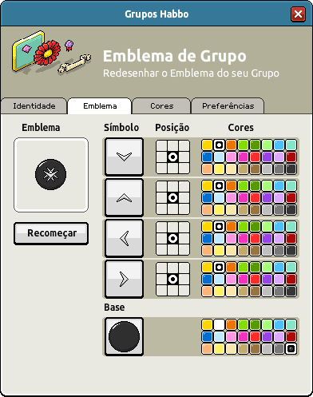

# **Habbo Group Badge Notation (HGBN) v1.1**

- **Specification Status:** Candidate
- **Date:** 2025-05-02
- **Available in:** English (original) • [Portuguese](./HGBN-v1_1-br.md) • [Spanish](./HGBN-v1_1-es.md)

<details><summary>Table of Contents</summary>
<div class="js-toc"></div>
</details>

## **1. Introduction**

### **1.1. Abstract**

**Habbo Group Badge Notation (HGBN) v1** is a standard for the text-based notation designed to represent group badges within the Habbo ecosystem. HGBN encodes structured badge data as a single string composed of multiple six-character segments. Each segment defines either a base image asset or a symbol overlay, including data about the asset id, tint color, and its placement on a 3×3 grid.

While HGBN v1 reflects current badge design definition, it is not an official format maintained by Sulake. Future updates or extensions may not be adopted by the company.

<div align="center">
  
</div>

### **1.2. Scope and Intent**

#### **1.2.1. This Document**

This specification exists to formalize and document how Habbo Hotel processes **group badge components**. It is:

- **An unofficial specification**, meaning Sulake may not adopt updates.
- **Meant for documentation and interoperability**, allowing developers to parse, generate, and manipulate group badges outside the game.

HGBN is **not a standard maintained by Sulake**, and its future extensions **MAY NOT** be reflected in the game's implementation.

#### **1.2.2. The Notation**

HGBN v1 is a textual representation of layered symbols designed for:

- **Storing badge configurations** as a compact text string
- **Programmatic parsing and generation** by developers and researchers
- Facilitating the **interoperability** of tools that render, manipulate, or analyze Habbo group badges

### **1.3. Audience**

This specification is intended for developers, researchers, archivists, and enthusiasts involved in the Habbo Hotel community, particularly those working on tools for Habbo group badges. It also serves as a common reference for understanding, implementing, and manipulating the Habbo Group Badge Notation (HGBN), which can be used for tasks such as developing interoperable software, emulators, and documentation for fan-driven projects. The audience also includes data scientists who may utilize this notation in image-related research or analysis. Familiarity with basic programming concepts, string manipulation, and image manipulation is recommended but not required.

---

## **2. Status of This Document**

HGBN v1.1 defines the current known structure for how group badge designs are stored, based on the original implementation in Habbo Hotel.

HAFN is **community-maintained**. While efforts are made to ensure accuracy, Sulake may change the format at any time. Future extensions will aim to preserve backward compatibility whenever possible.

---

## **3. Normative Language**

The key words "MUST", "MUST NOT", "REQUIRED", "SHALL", "SHALL NOT", "SHOULD", "SHOULD NOT", "RECOMMENDED", "MAY", and "OPTIONAL" in this document are to be interpreted as described in [RFC 2119](https://datatracker.ietf.org/doc/html/rfc2119).

---

## **4. Conformance**

An implementation is considered HGBN v1.1 compliant if it adheres to the syntax, processing rules, and constraints defined in this document. A conforming parser implementation:

- **MUST** support at least one base segment followed by one or more symbol segments.
- **MUST** reject badge strings that violate structural rules or value constraints.
- **MAY** extend functionality through non-official extensions, provided they **DO NOT** interfere with the core compliance.

A valid HGBN string **MUST**:

1. Follow the syntax definition in [Section 5](#5-syntax-definition).
2. Use correct data formatting (segment identifiers, fixed-length numbers, and position digits).
3. Ensure that the asset ids and color ids are exactly two digits each, and the position is a single digit representing a 3×3 grid value.

---

## **5. Syntax Definition**

### **5.1. Overview**

A HGBN v1 string represents a complete badge by concatenating multiple six-character segments. The string is always ordered starting with the asset that should be at the bottom (base, identified by `b`), followed by the assets on top (symbols, identified by `s` or `t`).

> [!NOTE]
> The trailing hash in the file name (e.g., `b01bfc395d8c4be707922c3da5b3f561`) is probably used for image caching and security and is **ignored in the notation specification**.

### **5.2. Grammar**

The following Extended Backus-Naur Form (EBNF) defines the syntax of HGBN v1.1:

```ebnf
<hgbn>           ::= <baseSegment><symbolSegment>+
<baseSegment>    ::= "b"<assetId><colorId><position>
<symbolSegment>  ::= <symbolType><assetId><colorId><position>
<symbolType>     ::= "s" | "t"
<assetId>        ::= <digit><digit>
<colorId>        ::= <digit><digit>
<position>       ::= <gridDigit>
<digit>          ::= "0" | "1" | "2" | "3" | "4" | "5" | "6" | "7" | "8" | "9"
<gridDigit>      ::= "0" | "1" | "2" | "3" | "4" | "5" | "6" | "7" | "8"
```

### **5.3. Lexical Constraints**

| Field       | Type      | Format                    | Description                                                                              |
|-------------|-----------|---------------------------|------------------------------------------------------------------------------------------|
| `segmentId` | Character | `b`, `s`, or `t`          | `b` indicates a base segment; `s` or `t` indicates a symbol segment.                     |
| `assetId`   | Integer   | Two digits (00-99)        | Identifier for the image asset.                                                          |
| `colorId`   | Integer   | Two digits (00-99)        | Color tint identifier for the asset.                                                     |
| `position`  | Integer   | One digit (0-8)           | Position on a 3×3 grid where the element is placed.                                      |

### **5.4. Regular Expression (Simplified)**

The following regular expression can be used to validate the general structure of an HGBN v1.1 string:

```regex
/^(b\d{2}\d{2}[0-8])((s|t)\d{2}\d{2}[0-8]){0,4}$/
```

---

## **6. Processing Model**

### **6.1. Badge Composition Semantics**

- The **base segment** is the foundation for the badge and **MUST** appear as the first segment.
- **Symbol segments** **MUST** be layered on top of the base in the order they appear in the string.
- The order of symbols affects rendering, with earlier symbols possibly appearing underneath later ones.

### **6.2. Rendering Considerations**

- The **assetId** corresponds to a specific image asset stored in the system.
- The **colorId** instructs how the asset image is tinted. Uncolorable portions (mask) of the asset remain unchanged.
- The **position** value, within a 3×3 grid (positions 0-8), determines where the asset is placed. Implementations **MUST** render the asset at the corresponding grid cell. The asset **MUST NOT** overflow the badge area.

### **6.3. Error Handling**

| Error Code                 | Description                                                 |
|----------------------------|-------------------------------------------------------------|
| **ERR_ASSET_ID_RANGE**     | `assetId` is not a two-digit number between 00 and 99.      |
| **ERR_COLOR_ID_RANGE**     | `colorId` is not a two-digit number between 00 and 99.      |
| **ERR_INVALID_POSITION**   | `position` is not a digit between 0 and 8.                  |
| **ERR_SYNTAX**             | The badge string is missing required segments or delimiters.|

An HGBN-compliant parser **MUST** reject invalid strings and report an appropriate error.

---

## **7. Example Entries**

### **7.1. Basic Example**

Consider the following example HGBN v1.1 string (without the trailing hash):

```txt
b12134s47114s46114s48114s45114
```

[](https://www.habbo.com.br/api/public/groups/g-hhbr-d5c67dd48b87d8b62f5a6a14ebbf4d8d)

**Explanation:**

- `b12134` → Base with asset id `12`, color id `13`, at grid position `4`.
- `s47114` → Symbol with asset id `47`, color id `11`, at grid position `4`.
- `s46114` → Symbol with asset id `46`, color id `11`, at grid position `4`.
- `s48114` → Symbol with asset id `48`, color id `11`, at grid position `4`.
- `s45114` → Symbol with asset id `45`, color id `11`, at grid position `4`.

### **7.2. Complete Example**

A badge with both `s` and `t` symbol types could be specified as:

```txt
b12063s78110t00118t27114
```

[](https://www.habbo.com.br/api/public/groups/g-hhbr-77d66c05a0d7373a02f17f0cd937115c)

**Explanation:**

- `b12063` → Base with asset id `12`, color id `06`, at grid position `3`.
- `s78110` → Symbol with asset id `78`, color id `11`, at grid position `0`.
- `t00118` → Symbol with asset id `00` (type `t`), color id `11`, at grid position `8`.
- `t27114` → Symbol with asset id `20` (type `t`), color id `11`, at grid position `4`.

### **7.3. Other Examples**

      

---

## **8. Extensibility and Future Work**

Possible future extensions of HGBN **MAY** include:

1. **Additional Segment Types:** More identifiers beyond `b`, `s`, and `t` to support new features.
2. **Expanded Ranges:** Extending the ranges of asset ids or color ids for upcoming visual designs.
3. **Positional Enhancements:** Defining more granular placements or layering priorities beyond the basic 3×3 grid.

Revisions to the specification **SHALL** be versioned appropriately, and backward compatibility **MAY** be maintained where possible.

---

## **9. Security Considerations**

Although HGBN is a textual notation and does not execute code, implementations **MUST** sanitize and validate input strings rigorously to prevent issues such as:

- Buffer overflows
- Injection attacks
- Improper rendering due to malformed input

Strict adherence to the syntax and processing guidelines is required for safe implementation.

---

## **10. References**

- [1] *Habbo Groups API*, Habbo.com.br. Available at: https://www.habbo.com.br/api/public/groups/g-hhbr-d5c67dd48b87d8b62f5a6a14ebbf4d8d
- [2] *Habbo Group Badge Render Service*, Habbo.com.br. Available at: https://www.habbo.com.br/habbo-imaging/badge/b12134s47114s46114s48114s45114f6bbe1ccfa2e8dd23d17c70895929672.png (also available in `.gif` format and through the `badge-fill` variant for non-transparent backgrounds)

---

## **11. Contributors**

This document was developed with contributions from:

- **[Alisson Nunes, "alynva"](https://alynva.com)**: Lead author
- **[Matheus, "ferrazmatheus"](https://x.com/ImFerraz_)**: Investigation

---

## **12. Changelog**

- **v1.1.0 - 2025-04-12**
  - Updating from `v1.0` due to new information found.
  - Filling the reference tables.
  - Fixing the zero-indexed position ids.
  - Minor touches of the draft.
- **v1.1.1 - 2025-04-17**
  - Standardizing the spec structure.
  - Minor touches of the draft.
- **v1.1.2 - 2025-04-18**
  - Minor grammar fixes.
- **v1.1.3 - 2025-05-02**
  - Markdown Alert tag fix.
  - Added Contributors Section.
  - Reorganized the last sections and renamed the Reference Table to Appendices.

---

## **13. Appendices**

The following tables list the approved asset mappings. Implementers and developers can use these tables as a reference for rendering badge components. The tables are sorted using the asset name, and where it says the index of it, it means the position in the game's list, followed by the number `row x column` of it, for ease navigation.

### **13.1. Appendix A. Group Badge Base Assets**

| Notation Prefix | Notation Id | Asset Id | Asset Name ▲ | Asset Index | Has Mask? | Colorable Image                                                                                       | Mask Image                                                                                            |
|-----------------|-------------|----------|--------------|-------------|-----------|-------------------------------------------------------------------------------------------------------|-------------------------------------------------------------------------------------------------------|
| `b`             | `06`        | 6        | advanced_1   | 6º (2x2)    | No        |              |                                                                                                       |
| `b`             | `07`        | 7        | advanced_2   | 7º (2x3)    | No        |              |                                                                                                       |
| `b`             | `08`        | 8        | advanced_3   | 8º (2x4)    | No        |              |                                                                                                       |
| `b`             | `09`        | 9        | advanced_4   | 9º (2x5)    | No        |              |                                                                                                       |
| `b`             | `01`        | 1        | basic_1      | 1º (1x2)    | No        |                    |                                                                                                       |
| `b`             | `02`        | 2        | basic_2      | 2º (1x3)    | No        |                    |                                                                                                       |
| `b`             | `03`        | 3        | basic_3      | 3º (1x4)    | No        |                    |                                                                                                       |
| `b`             | `04`        | 4        | basic_4      | 4º (1x5)    | No        |                    |                                                                                                       |
| `b`             | `05`        | 5        | basic_5      | 5º (2x1)    | No        |                    |                                                                                                       |
| `b`             | `21`        | 65       | beams        | 21º (5x2)   | Yes       |            |            |
| `b`             | `25`        | 118      | book         | 25º (6x1)   | No        |                          |                                                                                                       |
| `b`             | `15`        | 15       | circles_1    | 15º (4x1)   | No        |                |                                                                                                       |
| `b`             | `16`        | 16       | circles_2    | 16º (4x2)   | No        |                |                                                                                                       |
| `b`             | `26`        | 119      | egg          | 26º (6x2)   | No        |                            |                                                                                                       |
| `b`             | `10`        | 10       | gold_1       | 10º (3x1)   | Yes       |          |          |
| `b`             | `11`        | 11       | gold_2       | 11º (3x2)   | Yes       |          |          |
| `b`             | `13`        | 13       | gradient_1   | 13º (3x4)   | No        |              |                                                                                                       |
| `b`             | `14`        | 14       | gradient_2   | 14º (3x5)   | No        |              |                                                                                                       |
| `b`             | `19`        | 19       | misc_1       | 19º (4x5)   | Yes       |          |          |
| `b`             | `20`        | 20       | misc_2       | 20º (5x1)   | No        |                      |                                                                                                       |
| `b`             | `27`        | 120      | ornament     | 27º (6x3)   | No        |                  |                                                                                                       |
| `b`             | `17`        | 17       | ornament_1   | 17º (4x3)   | Yes       |  |  |
| `b`             | `18`        | 18       | ornament_2   | 18º (4x4)   | Yes       |  |  |
| `b`             | `12`        | 12       | pin          | 12º (3x3)   | Yes       |                |                |
| `b`             | `22`        | 66       | ring         | 22º (5x3)   | No        |                          |                                                                                                       |
| `b`             | `28`        | 121      | shield       | 28º (6x4)   | Yes       |          |          |
| `b`             | `23`        | 67       | simplestar   | 23º (5x4)   | Yes       |  |  |
| `b`             | `24`        | 68       | spiral       | 24º (5x5)   | No        |                      |                                                                                                       |

### **13.2. Appendix B. Group Badge Symbol Assets**

| Notation Prefix | Notation Id | Asset Id | Asset Name ▲     | Asset Index | Has Mask? | Colorable Image                                                                                                                          | Mask Image                                                                                                                               |
|-----------------|-------------|----------|------------------|-------------|-----------|------------------------------------------------------------------------------------------------------------------------------------------|------------------------------------------------------------------------------------------------------------------------------------------|
| `s`             | `68`        | 173      | 0                | 119º (24x5) | No        |                                            |                                                                                                                                          |
| `s`             | `69`        | 174      | 1                | 120º (25x1) | No        |                                            |                                                                                                                                          |
| `s`             | `70`        | 175      | 2                | 121º (25x2) | No        |                                            |                                                                                                                                          |
| `s`             | `71`        | 176      | 3                | 122º (25x3) | No        |                                            |                                                                                                                                          |
| `s`             | `72`        | 177      | 4                | 123º (25x4) | No        |                                            |                                                                                                                                          |
| `s`             | `73`        | 178      | 5                | 124º (25x5) | No        |                                            |                                                                                                                                          |
| `s`             | `74`        | 179      | 6                | 125º (26x1) | No        |                                            |                                                                                                                                          |
| `s`             | `75`        | 180      | 7                | 126º (26x2) | No        |                                            |                                                                                                                                          |
| `s`             | `76`        | 181      | 8                | 127º (26x3) | No        |                                            |                                                                                                                                          |
| `s`             | `77`        | 182      | 9                | 128º (26x4) | No        |                                            |                                                                                                                                          |
| `s`             | `78`        | 183      | a                | 129º (26x5) | No        |                                            |                                                                                                                                          |
| `t`             | `04`        | 122      | alligator        | 68º (14x4)  | No        |                            |                                                                                                                                          |
| `t`             | `05`        | 123      | americanfootball | 69º (14x5)  | Yes       |  |  |
| `s`             | `45`        | 69       | arrow_down       | 45º (10x1)  | No        |                          |                                                                                                                                          |
| `s`             | `46`        | 70       | arrow_left       | 46º (10x2)  | No        |                          |                                                                                                                                          |
| `s`             | `47`        | 71       | arrow_right      | 47º (10x3)  | No        |                        |                                                                                                                                          |
| `s`             | `48`        | 72       | arrow_up         | 48º (10x4)  | No        |                              |                                                                                                                                          |
| `s`             | `49`        | 73       | arrowbig_up      | 49º (10x5)  | No        |                        |                                                                                                                                          |
| `t`             | `06`        | 124      | award            | 70º (15x1)  | Yes       |                        |                        |
| `s`             | `50`        | 74       | axe              | 50º (11x1)  | Yes       |                            |                            |
| `s`             | `79`        | 184      | b                | 130º (27x1) | No        |                                            |                                                                                                                                          |
| `s`             | `01`        | 21       | background_1     | 1º (1x2)    | No        |                      |                                                                                                                                          |
| `s`             | `02`        | 22       | background_2     | 2º (1x3)    | No        |                      |                                                                                                                                          |
| `s`             | `03`        | 23       | background_3     | 3º (1x4)    | Yes       |          |          |
| `s`             | `04`        | 24       | ball_1           | 4º (1x5)    | Yes       |                      |                      |
| `s`             | `05`        | 25       | ball_2           | 5º (2x1)    | Yes       |                      |                      |
| `t`             | `07`        | 125      | bananapeel       | 71º (15x2)  | No        |                          |                                                                                                                                          |
| `t`             | `08`        | 126      | battleball       | 72º (15x3)  | No        |                          |                                                                                                                                          |
| `t`             | `09`        | 127      | biohazard        | 73º (15x4)  | No        |                            |                                                                                                                                          |
| `t`             | `10`        | 128      | bird             | 74º (15x5)  | No        |                                      |                                                                                                                                          |
| `t`             | `11`        | 129      | bishop           | 75º (16x1)  | No        |                                  |                                                                                                                                          |
| `s`             | `06`        | 26       | bobba            | 6º (2x2)    | No        |                                    |                                                                                                                                          |
| `s`             | `07`        | 27       | bomb             | 7º (2x3)    | Yes       |                          |                          |
| `s`             | `08`        | 28       | bow              | 8º (2x4)    | No        |                                        |                                                                                                                                          |
| `s`             | `09`        | 29       | box_1            | 9º (2x5)    | No        |                                    |                                                                                                                                          |
| `s`             | `10`        | 30       | box_2            | 10º (3x1)   | No        |                                    |                                                                                                                                          |
| `s`             | `51`        | 75       | bug              | 51º (11x2)  | Yes       |                            |                            |
| `s`             | `11`        | 31       | bunting_1        | 11º (3x2)   | No        |                            |                                                                                                                                          |
| `s`             | `12`        | 32       | bunting_2        | 12º (3x3)   | No        |                            |                                                                                                                                          |
| `s`             | `13`        | 33       | butterfly        | 13º (3x4)   | Yes       |                |                |
| `s`             | `80`        | 185      | c                | 131º (27x2) | No        |                                            |                                                                                                                                          |
| `s`             | `52`        | 76       | capsbig          | 52º (11x3)  | Yes       |                    |                    |
| `s`             | `53`        | 77       | capssmall        | 53º (11x4)  | Yes       |                |                |
| `s`             | `54`        | 78       | cloud            | 54º (11x5)  | No        |                                    |                                                                                                                                          |
| `t`             | `12`        | 130      | coalion          | 76º (16x2)  | No        |                                |                                                                                                                                          |
| `t`             | `13`        | 131      | cocoamug         | 77º (16x3)  | No        |                              |                                                                                                                                          |
| `s`             | `14`        | 34       | cowskull         | 14º (3x5)   | Yes       |                  |                  |
| `t`             | `14`        | 210      | credit           | 156º (32x2) | Yes       |                      |                      |
| `s`             | `15`        | 35       | cross            | 15º (4x1)   | No        |                                    |                                                                                                                                          |
| `s`             | `55`        | 79       | crown            | 55º (12x1)  | Yes       |                        |                        |
| `s`             | `81`        | 186      | d                | 132º (27x3) | No        |                                            |                                                                                                                                          |
| `t`             | `15`        | 132      | dashflag         | 78º (16x4)  | No        |                              |                                                                                                                                          |
| `s`             | `16`        | 36       | diamond          | 16º (4x2)   | No        |                                |                                                                                                                                          |
| `t`             | `16`        | 133      | diamondring      | 79º (16x5)  | Yes       |            |            |
| `s`             | `57`        | 81       | diamsmall        | 57º (12x3)  | No        |                            |                                                                                                                                          |
| `s`             | `56`        | 80       | diamsmall2       | 56º (12x2)  | No        |                          |                                                                                                                                          |
| `s`             | `17`        | 37       | diploma          | 17º (4x3)   | Yes       |                    |                    |
| `t`             | `17`        | 134      | discoball        | 80º (17x1)  | Yes       |                |                |
| `t`             | `18`        | 135      | dog              | 81º (17x2)  | No        |                                        |                                                                                                                                          |
| `s`             | `58`        | 82       | drop             | 58º (12x4)  | No        |                                      |                                                                                                                                          |
| `s`             | `82`        | 187      | e                | 133º (27x4) | No        |                                            |                                                                                                                                          |
| `t`             | `19`        | 136      | electricguitarh  | 82º (17x3)  | Yes       |    |    |
| `t`             | `20`        | 137      | electricguitarv  | 83º (17x4)  | Yes       |    |    |
| `s`             | `18`        | 38       | eyeball          | 18º (4x4)   | Yes       |                    |                    |
| `s`             | `83`        | 188      | f                | 134º (27x5) | No        |                                            |                                                                                                                                          |
| `t`             | `21`        | 138      | film             | 84º (17x5)  | No        |                                      |                                                                                                                                          |
| `s`             | `59`        | 83       | fingersheavy     | 59º (12x5)  | No        |                      |                                                                                                                                          |
| `s`             | `60`        | 84       | fingersv         | 60º (13x1)  | No        |                              |                                                                                                                                          |
| `s`             | `19`        | 39       | fist             | 19º (4x5)   | No        |                                      |                                                                                                                                          |
| `s`             | `20`        | 40       | flame_1          | 20º (5x1)   | No        |                                |                                                                                                                                          |
| `s`             | `21`        | 41       | flame_2          | 21º (5x2)   | No        |                                |                                                                                                                                          |
| `t`             | `22`        | 139      | flame            | 85º (18x1)  | Yes       |                        |                        |
| `s`             | `22`        | 42       | flash            | 22º (5x3)   | No        |                                    |                                                                                                                                          |
| `s`             | `23`        | 43       | flower_1         | 23º (5x4)   | Yes       |                  |                  |
| `s`             | `24`        | 44       | flower_2         | 24º (5x5)   | No        |                              |                                                                                                                                          |
| `s`             | `25`        | 45       | flower_3         | 25º (6x1)   | No        |                              |                                                                                                                                          |
| `s`             | `26`        | 46       | flower_4         | 26º (6x2)   | No        |                              |                                                                                                                                          |
| `s`             | `27`        | 47       | football         | 27º (6x3)   | No        |                              |                                                                                                                                          |
| `s`             | `84`        | 189      | g                | 135º (28x1) | No        |                                            |                                                                                                                                          |
| `t`             | `23`        | 140      | gamepad          | 86º (18x2)  | No        |                                |                                                                                                                                          |
| `t`             | `24`        | 141      | gem1             | 87º (18x3)  | Yes       |                          |                          |
| `t`             | `25`        | 142      | gem2             | 88º (18x4)  | Yes       |                          |                          |
| `t`             | `26`        | 143      | gem3             | 89º (18x5)  | Yes       |                          |                          |
| `s`             | `61`        | 85       | gtr              | 61º (13x2)  | Yes       |                            |                            |
| `s`             | `85`        | 190      | h                | 136º (28x2) | No        |                                            |                                                                                                                                          |
| `s`             | `62`        | 86       | hat              | 62º (13x3)  | No        |                                        |                                                                                                                                          |
| `t`             | `27`        | 144      | hawk             | 90º (19x1)  | No        |                                      |                                                                                                                                          |
| `t`             | `58`        | 211      | hc               | 157º (32x3) | Yes       |                              |                              |
| `s`             | `28`        | 48       | heart_1          | 28º (6x4)   | Yes       |                    |                    |
| `s`             | `29`        | 49       | heart_2          | 29º (6x5)   | Yes       |                    |                    |
| `t`             | `28`        | 145      | hearts_down      | 91º (19x2)  | No        |                        |                                                                                                                                          |
| `t`             | `29`        | 146      | hearts_up        | 92º (19x3)  | No        |                            |                                                                                                                                          |
| `t`             | `30`        | 147      | horseshoe        | 93º (19x4)  | No        |                            |                                                                                                                                          |
| `s`             | `86`        | 191      | i                | 137º (28x3) | No        |                                            |                                                                                                                                          |
| `t`             | `31`        | 148      | inksplatter      | 94º (19x5)  | No        |                        |                                                                                                                                          |
| `s`             | `87`        | 192      | j                | 138º (28x4) | No        |                                            |                                                                                                                                          |
| `s`             | `30`        | 50       | jingjang         | 30º (7x1)   | Yes       |                  |                  |
| `s`             | `88`        | 193      | k                | 139º (28x5) | No        |                                            |                                                                                                                                          |
| `s`             | `89`        | 194      | l                | 140º (29x1) | No        |                                            |                                                                                                                                          |
| `t`             | `32`        | 149      | leaf             | 95º (20x1)  | No        |                                      |                                                                                                                                          |
| `s`             | `31`        | 51       | lips             | 31º (7x2)   | Yes       |                          |                          |
| `s`             | `90`        | 195      | m                | 141º (29x2) | No        |                                            |                                                                                                                                          |
| `t`             | `33`        | 150      | micstand         | 96º (20x2)  | No        |                              |                                                                                                                                          |
| `t`             | `34`        | 151      | mirror           | 97º (20x3)  | Yes       |                      |                      |
| `t`             | `35`        | 152      | monkeywrench     | 98º (20x4)  | No        |                      |                                                                                                                                          |
| `s`             | `91`        | 196      | n                | 142º (29x3) | No        |                                            |                                                                                                                                          |
| `s`             | `32`        | 52       | note             | 32º (7x3)   | No        |                                      |                                                                                                                                          |
| `t`             | `36`        | 153      | note1            | 99º (20x5)  | No        |                                    |                                                                                                                                          |
| `t`             | `37`        | 154      | note2            | 100º (21x1) | No        |                                    |                                                                                                                                          |
| `t`             | `38`        | 155      | note3            | 101º (21x2) | No        |                                    |                                                                                                                                          |
| `t`             | `39`        | 156      | nursecross       | 102º (21x3) | No        |                          |                                                                                                                                          |
| `s`             | `92`        | 197      | o                | 143º (29x4) | No        |                                            |                                                                                                                                          |
| `s`             | `63`        | 87       | oval             | 63º (13x4)  | Yes       |                          |                          |
| `s`             | `93`        | 198      | p                | 144º (29x5) | No        |                                            |                                                                                                                                          |
| `s`             | `64`        | 88       | pawprint         | 64º (13x5)  | No        |                              |                                                                                                                                          |
| `s`             | `33`        | 53       | peace            | 33º (7x4)   | No        |                                    |                                                                                                                                          |
| `t`             | `40`        | 157      | pencil           | 103º (21x4) | Yes       |                      |                      |
| `t`             | `41`        | 209      | pixel            | 155º (32x1) | Yes       |                        |                        |
| `s`             | `34`        | 54       | planet           | 34º (7x5)   | Yes       |                      |                      |
| `s`             | `94`        | 199      | q                | 145º (30x1) | No        |                                            |                                                                                                                                          |
| `t`             | `42`        | 158      | queen            | 104º (21x5) | No        |                                    |                                                                                                                                          |
| `s`             | `95`        | 200      | r                | 146º (30x2) | No        |                                            |                                                                                                                                          |
| `s`             | `35`        | 55       | rainbow          | 35º (8x1)   | Yes       |                    |                    |
| `t`             | `43`        | 159      | rock             | 105º (22x1) | No        |                                      |                                                                                                                                          |
| `t`             | `44`        | 160      | rook             | 106º (22x2) | No        |                                      |                                                                                                                                          |
| `s`             | `36`        | 56       | rosete           | 36º (8x2)   | No        |                                  |                                                                                                                                          |
| `s`             | `96`        | 201      | s                | 147º (30x3) | No        |                                            |                                                                                                                                          |
| `s`             | `65`        | 89       | screw            | 65º (14x1)  | No        |                                    |                                                                                                                                          |
| `s`             | `37`        | 57       | shape            | 37º (8x3)   | No        |                                    |                                                                                                                                          |
| `t`             | `45`        | 161      | skate            | 107º (22x3) | No        |                                    |                                                                                                                                          |
| `t`             | `46`        | 162      | smallring        | 108º (22x4) | Yes       |                |                |
| `t`             | `47`        | 163      | snowstorm        | 109º (22x5) | Yes       |                |                |
| `t`             | `48`        | 164      | sphere           | 110º (23x1) | No        |                                  |                                                                                                                                          |
| `t`             | `49`        | 165      | spraycan         | 111º (23x2) | Yes       |                  |                  |
| `s`             | `38`        | 58       | star_1           | 38º (8x4)   | No        |                                  |                                                                                                                                          |
| `s`             | `39`        | 59       | star_2           | 39º (8x5)   | No        |                                  |                                                                                                                                          |
| `t`             | `50`        | 166      | stars1           | 112º (23x3) | No        |                                  |                                                                                                                                          |
| `t`             | `51`        | 167      | stars2           | 113º (23x4) | No        |                                  |                                                                                                                                          |
| `t`             | `52`        | 168      | stars3           | 114º (23x5) | No        |                                  |                                                                                                                                          |
| `t`             | `53`        | 169      | stars4           | 115º (24x1) | No        |                                  |                                                                                                                                          |
| `t`             | `54`        | 170      | stars5           | 116º (24x2) | No        |                                  |                                                                                                                                          |
| `s`             | `66`        | 90       | stickL           | 66º (14x2)  | Yes       |                      |                      |
| `s`             | `67`        | 91       | stickR           | 67º (14x3)  | Yes       |                      |                      |
| `s`             | `40`        | 60       | sword_1          | 40º (9x1)   | Yes       |                    |                    |
| `s`             | `41`        | 61       | sword_2          | 41º (9x2)   | Yes       |                    |                    |
| `s`             | `42`        | 62       | sword_3          | 42º (9x3)   | Yes       |                    |                    |
| `s`             | `97`        | 202      | t                | 148º (30x4) | No        |                                            |                                                                                                                                          |
| `s`             | `98`        | 203      | u                | 149º (30x5) | No        |                                            |                                                                                                                                          |
| `s`             | `99`        | 204      | v                | 150º (31x1) | No        |                                            |                                                                                                                                          |
| `t`             | `55`        | 212      | vip              | 158º (32x4) | Yes       |                            |                            |
| `t`             | `00`        | 205      | w                | 151º (31x2) | No        |                                            |                                                                                                                                          |
| `t`             | `56`        | 171      | waterdrop        | 117º (24x3) | Yes       |                |                |
| `s`             | `43`        | 63       | wings_1          | 43º (9x4)   | No        |                                |                                                                                                                                          |
| `s`             | `44`        | 64       | wings_2          | 44º (9x5)   | No        |                                |                                                                                                                                          |
| `t`             | `57`        | 172      | wolverine        | 118º (24x4) | No        |                            |                                                                                                                                          |
| `t`             | `01`        | 206      | x                | 152º (31x3) | No        |                                            |                                                                                                                                          |
| `t`             | `02`        | 207      | y                | 153º (31x4) | No        |                                            |                                                                                                                                          |
| `t`             | `03`        | 208      | z                | 154º (31x5) | No        |                                            |                                                                                                                                          |

### **13.3. Appendix C. Group Badge Color IDs and Tints**

| Id   | Color Index | Hex Color | Preview                                                   |
|------|-------------|-----------|-----------------------------------------------------------|
| `01` | 1º (1x1)    | `#ffd601` |  |
| `11` | 2º (1x2)    | `#ffffff` |  |
| `02` | 3º (1x3)    | `#ec7600` |  |
| `03` | 4º (1x4)    | `#84de00` |  |
| `04` | 5º (1x5)    | `#589a00` |  |
| `18` | 6º (1x6)    | `#aaff7d` |  |
| `05` | 7º (1x7)    | `#50c1fb` |  |
| `19` | 8º (1x8)    | `#87e6c8` |  |
| `06` | 9º (2x1)    | `#006fcf` |  |
| `16` | 10º (2x2)   | `#c2eaff` |  |
| `07` | 11º (2x3)   | `#ff98e3` |  |
| `08` | 12º (2x4)   | `#f334bf` |  |
| `09` | 13º (2x5)   | `#ff2d2d` |  |
| `20` | 14º (2x6)   | `#9844e7` |  |
| `21` | 15º (2x7)   | `#dea9ff` |  |
| `10` | 16º (2x8)   | `#af0a0a` |  |
| `22` | 17º (3x1)   | `#ffb579` |  |
| `17` | 18º (3x2)   | `#fff165` |  |
| `14` | 19º (3x3)   | `#fbe7ac` |  |
| `23` | 20º (3x4)   | `#c3aa6e` |  |
| `15` | 21º (3x5)   | `#977641` |  |
| `12` | 22º (3x6)   | `#c0c0c0` |  |
| `24` | 23º (3x7)   | `#7a7a7a` |  |
| `13` | 24º (3x8)   | `#373737` |  |

### **13.4. Appendix D. Group Badge Grid Positions**

| **Position Id** | **Grid Cell**    |
|-----------------|------------------|
| 0               | Top-left         |
| 1               | Top-center       |
| 2               | Top-right        |
| 3               | Middle-left      |
| 4               | Center           |
| 5               | Middle-right     |
| 6               | Bottom-left      |
| 7               | Bottom-center    |
| 8               | Bottom-right     |
