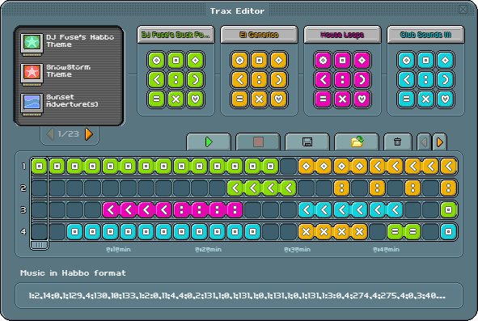

# **Habbo Music Notation (HMN) v1.0**  

**Status:** Draft  

## **1. Abstract**  

**Habbo Music Notation (HMN)** is a community-documented of the text-based notation that Habbo Hotel uses to represent its music sequences in the **Traxmachine**. It encodes structured data for **music layers, sample references, and durations** as a single-line string. While HMN reflects how Habbo Hotel interprets music tracks, it is not an official format, and future updates may not be adopted by Sulake.

<div align=center></div>

## **2. Scope and Intent**

HMN was created by the community to formally document how Habbo Hotel processes **Traxmachine music encoding**. It is:
- **An unofficial specification**, meaning Sulake may not adopt updates.
- **A notation system**, stored as a **text string** in databases, rather than a file format.
- **Meant for documentation and interoperability**, allowing developers to parse, generate, and manipulate Traxmachine sequences outside the game.
HMN is **not a standard maintained by Sulake**, and its future extensions **MAY NOT** be reflected in the game’s implementation.

## **3. Status of This Document**  

This document defines HMN v1.0, **based on observations of how Traxmachine processes music sequences**. HMN is a **community-maintained** format, and while efforts are made to ensure accuracy, there is **no guarantee that Sulake will adopt future revisions**.

Future updates may introduce **non-official extensions** that extend HMN beyond the game’s native capabilities.

## **4. Conformance**  

An HMN-compliant parser **MUST** correctly interpret the syntax and structure defined in this document. Implementations **MUST** support at least **four layers** and **sample IDs up to 648**. Extended implementations **MAY** support additional layers and sample ranges.  

A valid HMN file **MUST**:  
1. Follow the **syntax definition** in Section 5.  
2. Maintain **correct data formatting** (colons, semicolons, and numbers).  
3. **Not exceed** the specified **sample ID range** (0-648).  
4. Ensure that **durations are positive integers** and **multiples of its sample duration**.  

Invalid entries **MUST** be rejected by an HMN-compliant parser.

---

## **5. Syntax Definition**  
### **5.1. Grammar**  
An HMN file consists of **one or more layers**, each containing a sequence of **samples with durations**. The format is formally defined as follows:  

```ebnf
<layerList> ::= <layer>+
<layer> ::= <layerId> ":" <sampleList> ":"
<layerId> ::= [1-4]
<sampleList> ::= <sample> (";" <sample>)*
<sample> ::= <sampleId> "," <duration>
<sampleId> ::= <posIntUpTo648>
<duration> ::= <positiveInteger>
```

### **5.2. Value Constraints**  
| Field      | Type         | Range / Description                       |
|------------|--------------|-------------------------------------------|
| `layerId`  | Integer      | `1-4` (default)                           |
| `sampleId` | Integer      | `0-648` (`0` represents silence)          |
| `duration` | Integer      | Positive integer, each unit = `2 seconds` |

### **5.3. Regular Expression (Simplified)**  
```
/^(?:(\d+):(?:(\d+),(\d+))(;(?:(\d+),(\d+)))*:)+$/
```

---

## **6. Processing Model**  
### **6.1. Layer Order**  
- Layers **MUST** be parsed independently.  
- The **order of layers** does **not** affect playback.  

### **6.2. Sample Handling**  
- Each **sampleId** represents a **global index** (not tied to a specific pack).  
- `0` (zero) is **silence** and **MUST NOT** be played.  
- Adjacent identical **sample IDs MUST be merged** into a single entry.  

### **6.3. Duration Constraints**  
- Each **duration unit** corresponds to **2 seconds**.  
- The duration **MUST** be a multiple of **(sample length ÷ 2)**.  

### **6.4. Parsing Requirements**  
- Colons (`:`) **MUST** be present for every layer.  
- Empty layers **MUST** be ignored in playback.  

---

## **7. Example Files**  
### **7.1. Basic Example**  
```
1:12,4;34,2;0,1;56,6:2:22,3;45,2;67,4:3:0,5;31,3;44,2:4:12,6;34,4:
```

### **7.2. Example from "Habbowood" (Michael Bauble)**
```
1:280,4;265,4;264,4;263,8;0,16:2:262,4;263,8;266,4;267,4;264,12;262,4:3:0,4;268,8;269,4;270,4;268,8;282,4;285,4:4:0,20;74,4;75,3;81,3;0,6:
```

---

## **8. Error Handling**  
| Error Type           | Description |
|---------------------|-------------|
| **Invalid Sample ID** | A `sampleId` outside `0-648` is invalid. |
| **Invalid Duration** | A non-positive integer for `duration` is invalid. |
| **Incorrect Format** | Missing colons or incorrect separators result in parsing failure. |

An HMN-compliant parser **MUST** reject invalid files and return an appropriate error.  

---

## **9. Future Extensions**  
The following extensions **MAY** be introduced in future versions:  
1. **More than 4 layers** for enhanced complexity.
2. **Additional samples**, exclusive for oficial songs or future releases.
3. **A binary format (HMN-B)** for compact storage.

---

## **10. Security Considerations**  
HMN is a **text-based** format and does not pose **security risks** related to execution or arbitrary code execution. However, implementations **MUST** validate input to prevent **buffer overflows or injection attacks** when storing HMN data in a database or processing system.  

---

## **11. References**  
- *[Musics Archive - Habbianos](https://github.com/Habbianos/Traxmachine/blob/main/components/musics-archive/README.md)*  

---

### **Changelog**  
**v1.0 – 2025-02-06**  
- Initial draft of the HMN specification.  
