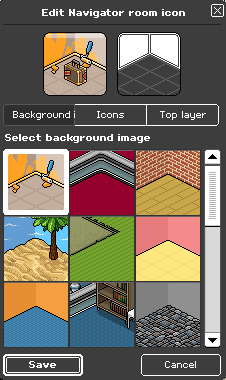

# **Habbo Room Icon Notation (HRIN) v1.0**

- **Specification Status:** Draft
- **Date:** 2025-04-18
- **Available in:** English

<details><summary>Table of Contents</summary>
<div class="js-toc"></div>
</details>

## **1. Introduction**

### **1.1 Abstract**

**Habbo Room Icon Notation (HRIN) v1.0** is a standard for the text-based notation designed to represent room icons in a compact, human- and machine-readable form. It encodes the background, top-layer style, and a set of optional items (with their positions and identifiers) as a single string, facilitating storage, parsing, generation, and interoperability of room icon configurations.

While HRIN v1 reflects the room icon definition, it is not an official format maintained by Sulake. Future updates or extensions may not be adopted by the company.

<div align="center">
  
</div>

### **1.2 Scope and Intent**

#### **1.2.1 This Document**

This specification exists to formalize and document how Habbo Hotel processes **room icon configurations**. It is:

- **An unofficial specification**, maintained by the community for clarity and tooling support.
- **Meant for documentation and interoperability**, enabling developers to parse, generate, and manipulate room icons outside any specific platform.

HRIN is **not a standard maintained by Sulake**, and its future extensions **MAY NOT** be reflected in the game's implementation.

#### **1.2.2 The Notation**

HRIN v1 is a textual representation of layered symbols that enables:

- **Compact storage** of room icon settings as a single string.
- **Programmatic parsing and validation** by tools and scripts.
- **Ease of sharing and versioning** through text-based formats.

### **1.3 Audience**

This specification is intended for developers, designers, and enthusiasts involved in the Habbo Hotel community, particularly those working on tools for creating or manipulating room icons. It also serves as a common reference for understanding, implementing, and manipulating the Habbo Room Icon Notation (HRIN), which can be used for tasks such as developing interoperable software, emulators, and documentation for fan-driven projects. Familiarity with basic programming concepts, string manipulation, and markup languages is recommended but not required.

---

## **2. Status of This Document**

HRIN v1.0 defines the known structure for how room icon designs used to be stored, based on the original implementation in Habbo Hotel.

HRIN is **community-maintained**. While efforts are made to ensure accuracy, Sulake may change the format at any time. Future extensions will aim to preserve backward compatibility whenever possible.

---

## **3. Normative Language**

The key words "MUST", "MUST NOT", "REQUIRED", "SHALL", "SHALL NOT", "SHOULD", "SHOULD NOT", "RECOMMENDED", "MAY", and "OPTIONAL" in this document are to be interpreted as described in [RFC 2119](https://datatracker.ietf.org/doc/html/rfc2119).

---

## **4. Conformance**

An implementation is considered HRIN v1.0 compliant if it adheres to the syntax, processing rules, and constraints defined in this document. A conforming parser implementation:

- **MUST** support at least the background and top layer definition.
- **MUST** reject strings that violate structural rules or value constraints.
- **MAY** support optional extensions provided they do not conflict with the core syntax.

A valid HRIN string **MUST**:

1. Follow the grammar defined in [Section 5](#5-syntax-definition).
2. Use correct numeric ranges for each field.
3. Separate the three main components (background, top layer, items) with pipe (`|`) characters.

---

## **5. Syntax Definition**

### **5.1 Overview**

A HRIN v1 string represents a room icon by concatenating three parts. The first defines the background with a value from 1 to 24 indicating one of the available backgrounds. The second defines the top_layer with a value from 0 to 11 indicating the style applied on top of everything. The third defines the items with zero or more items, each specifying a position (0–10) and an item identifier (1–27).

### **5.2 Grammar**

The following Extended Backus-Naur Form (EBNF) defines the syntax of HRIN v1.0:

```ebnf
<room_icon>   ::= <background> "|" <top_layer> "|" [ <item> ( " " <item> )* ]
<background>  ::= 1..24
<top_layer>   ::= 0..11
<item>        ::= <position> "," <item_id>
<position>    ::= 0..10
<item_id>     ::= 1..27
```

### **5.3 Lexical Constraints**

| Field        | Type    | Format      | Description                                        |
|--------------|---------|-------------|----------------------------------------------------|
| `background` | Integer | 1-2 digits  | ID of the background (1 through 24).               |
| `top_layer`  | Integer | 1-2 digits  | ID of the top-layer style (0 through 11).          |
| `position`   | Integer | 1-2 digits  | Grid or slot position (0 through 10).              |
| `item_id`    | Integer | 1-2 digits  | ID of the room item (1 through 27).                |

### **5.4 Regular Expression**

The following regular expression can be used to validate the general structure of an HRIN v1.0 string:

```regex
/^[1-9]\d?\|(?:0|[1-9]|1[0-1])\|(?:[0-9]|10),(?:[1-9]|1\d|2[0-7])(?: (?:[0-9]|10),(?:[1-9]|1\d|2[0-7]))*$/
```

---

## **6. Processing Model**

### **6.1 Composition Semantics**

- The **background** value defines the base layer and **MUST** appear first.
- The **top_layer** value applies on top of the background and **MUST** appear second.
- **Item** entries, if present, **MUST** follow after the second pipe, separated by spaces.
- The order of item entries does **NOT** affect rendering order; implementers **MAY** reorder items as needed.

### **6.2 Rendering Considerations**

- The **background** IDs correspond to predefined background assets.
- The **top_layer** IDs correspond to overlay styles (e.g. borders).
- The **position** of each **item** is referencing the isometric tiles, like in-game, but the tiles doesn't fill a square. The fist row has 3 tiles, the second has 4, the third has 3, the fourfh has 1, just like seen in the [Section 1](#1-introduction).
- After composing the assets togetter, a [frame](http://room.alynva.com/assets/frame.png) **MAY** be applied to the image, as a final touch to the icon.

### **6.3 Error Handling**

| Error Code               | Description                                                          |
|--------------------------|----------------------------------------------------------------------|
| ERR_BACKGROUND_RANGE     | `background` is outside the range 1–24.                              |
| ERR_TOP_LAYER_RANGE      | `top_layer` is outside the range 0–11.                               |
| ERR_ITEM_SYNTAX          | An `item` entry does not match `<position>,<item_id>`.               |
| ERR_POSITION_RANGE       | `position` is outside the range 0–10.                                |
| ERR_ITEM_ID_RANGE        | `item_id` is outside the range 1–27.                                 |
| ERR_SYNTAX               | The HRIN string violates the overall grammar or missing delimiters.  |

An HRIN-compliant parser **MUST** reject invalid strings and report an appropriate error.

---

## **7. Example Entries**

### **7.1. Basic Example**

Consider the following example HRIN v1.0 string, considered the default:

```txt
1|0|
```

[](http://room.alynva.com/?frame=1&icon=1%7C0%7C)

**Explanation:**

- `1` → Background with asset id `1`.
- `0` → Top layer with asset id `0`.

### **7.2. Complete Example**

```txt
2|9|6,3 7,5 9,4
```

[](http://room.alynva.com/?frame=1&icon=2%7C9%7C6,3%207,5%209,4)

**Explanation:**

- `2` → Background with asset id `2`.
- `9` → Top layer with asset id `9`.
- `6,3` → Item with asset id `3` in the position `6`.
- `7,5` → Item with asset id `5` in the position `7`.
- `9,4` → Item with asset id `4` in the position `9`.

### **7.3. Other Examples**

         

---

## **8. Extensibility and Future Work**

Future extensions **MAY** include:

1. **Additional layers:** Introducing mid-layers or cyclic layers beyond `top_layer`.
2. **Dynamic ranges:** Allowing higher ID ranges for backgrounds or items.
3. **Metadata segments:** Embedding optional flags or metadata (e.g., animations).

Revisions **SHALL** be versioned to maintain clarity and backward compatibility.

---

## **9. Security Considerations**

Although HRIN is a textual notation and does not execute code, implementations **MUST** sanitize and validate input strings rigorously to prevent issues such as:

- Buffer overflows
- Injection attacks
- Improper rendering due to malformed input

Strict adherence to the syntax and processing guidelines is required for safe implementation.

---

## **10. Reference Tables for Room Icon Assets**

The following tables list the approved asset mappings. Implementers and developers can use these tables as a reference for rendering icon components.

### **10.1 Background Assets**

| Notation Id | Image |
|-------------|-------|
| `1`         |  |
| `2`         |  |
| `3`         |  |
| `4`         |  |
| `5`         |  |
| `6`         |  |
| `7`         |  |
| `8`         |  |
| `9`         |  |
| `10`        |  |
| `11`        |  |
| `12`        |  |
| `13`        |  |
| `14`        |  |
| `15`        |  |
| `16`        |  |
| `17`        |  |
| `18`        |  |
| `19`        |  |
| `20`        |  |
| `21`        |  |
| `22`        |  |
| `23`        |  |

### **10.2 Top-Layer Assets**

| Notation Id | Image |
|-------------|-------|
| `0`         | No top layer |
| `1`         |  |
| `2`         |  |
| `3`         |  |
| `4`         |  |
| `5`         |  |
| `6`         |  |
| `7`         |  |
| `8`         |  |
| `9`         |  |
| `10`        |  |
| `11`        |  |

### **10.3 Item Assets**

| Notation Id | Image |
|-------------|-------|
| `1`         |  |
| `2`         |  |
| `3`         |  |
| `4`         |  |
| `5`         |  |
| `6`         |  |
| `7`         |  |
| `8`         |  |
| `9`         |  |
| `10`        |  |
| `11`        |  |
| `12`        |  |
| `13`        |  |
| `14`        |  |
| `15`        |  |
| `16`        |  |
| `17`        |  |
| `18`        |  |
| `19`        |  |
| `20`        |  |
| `21`        |  |
| `22`        |  |
| `23`        |  |
| `24`        |  |
| `25`        |  |
| `26`        |  |
| `27`        |  |

### **10.4 Position Mapping**

| **Position** | **Description**    |
|--------------|--------------------|
| 0            | Tile 0             |
| 1            | Tile 1             |
| ...          | ...                |
| 10           | Tile 10            |

---

## **11. References**

- *[`Quackster/Havana`](https://github.com/Quackster/Havana/blob/master/Havana-Server/src/main/java/org/alexdev/havana/messages/flash/incoming/rooms/FLASH_ROOMICONDATA.java) Habbo server emulator*
- *Editor image from [`Nappa Hotel`](https://x.com/nappahotel) retro*
- *Asset images from [`Habbo Hotel flash client`](https://images.habbo.com/gordon/flash-assets-PRODUCTION-202410101731-688101468/Habbo.swf) decompilation*

---

### **Changelog**

- **v1.0.0 - 2025-04-18**
  - Initial draft of the HRIN specification.
- **v1.0.1 - 2025-04-30**
  - Minor touches in the Abstract section.
